# CRAVE Drive-native document pipeline

**Trạng thái:** source contract cho R05-A28; chưa deploy.  
**Mục tiêu:** tài liệu thật trong Google Drive trở thành nguồn catalog có truy
vết và cuối cùng hiển thị an toàn trên dashboard.

## Luồng đích

```mermaid
flowchart LR
  A["Google Drive PDF<br/>file_id + binary SHA-256"] --> B["source_registry / raw_files<br/>license + sync + hash"]
  B --> C["documents<br/>Drive-native REF-* catalog"]
  C --> D["document_versions<br/>immutable ingest version"]
  D --> E["Parse / OCR staging<br/>table + figure + page provenance"]
  E --> F["Accountable human review"]
  F --> G["document_chunks<br/>document_version_id FK"]
  G --> H["Embedding recertification<br/>model + dimension + input hash"]
  H --> I["Retrieval + exact citation<br/>chunk → version → raw file"]
  I --> J["Dashboard<br/>reference lane + AI readiness"]
```

## Nguyên tắc chuyển đổi

1. Mười record `GMP-SOP-001..010` là placeholder nội bộ, không phải 12 PDF
   ISO/PDA/ISPE đang có. Chúng được **retire/de-scope**, không hard-delete:
   `status=archived`, `approved_for_ai_use=false`, giữ version/chunk/audit.
2. Mười hai PDF thật dùng mã `REF-*` riêng. Filename và binary không đổi; Drive
   file ID và SHA-256 là identity evidence.
3. Quyết định “đưa tài liệu Drive lên dashboard” chỉ quyết định phạm vi catalog,
   không tự động phê duyệt nội dung GMP hoặc bật AI retrieval.
4. Dashboard phải phân biệt `Tài liệu tham khảo` với `SOP nội bộ`, đồng thời hiển
   thị `Chờ review` cho mọi record chưa đủ version/review/index evidence.
5. `VQ-QT-003` và `WHO-TRS-996` không thuộc yêu cầu retire 10 SOP; giữ fail-closed
   cho tới khi có quyết định riêng.

## Liên kết P0

| Gate | Điều kiện trong luồng Drive-native |
|---|---|
| BLK-003 | Tạo 12 logical `REF-*` records, raw/hash ingest version và current pointer live verified |
| BLK-004 | Review 12 tài liệu và 5 trang OCR có tên/vai trò/timestamp/quyết định |
| BLK-005 | Tạo chunks cho đúng current version; 100% embedding coverage hoặc exclusion được duyệt |
| BLK-006 | Deploy/backfill FK chunk→version; runtime query/citation chỉ ra đúng chunk/version/raw hash |
| BLK-007 | U10 retrieval/RLS, U11 citation, U13 audit/tool log, U14 eval, U15 health rồi agent canary |

## Trạng thái hiển thị dashboard

| Trạng thái bằng chứng | Dashboard lane | AI retrieval |
|---|---|---|
| Catalog + Drive identity, chưa review | `Tài liệu tham khảo / Chờ review` | DENY |
| Parse/OCR reviewed, chưa embedding/citation | `Tài liệu tham khảo / Đã review` | DENY |
| Version + chunks + embedding + citation gates PASS | `Tài liệu tham khảo / Sẵn sàng AI` | ALLOW theo RLS |
| Retired placeholder | Ẩn khỏi danh sách mặc định; auditor/admin có thể xem archive | DENY |

## Ranh giới triển khai

- Local source đã có catalog CSV, retirement plan, read-only live preflight và
  migration 030 cho chunk-version lineage.
- Chưa có Supabase write/apply, n8n update/execute/publish hoặc Git remote.
- Trước change set catalog phải chạy preflight live để xác nhận enum, NOT NULL,
  RLS, dependent rows và collision mã `REF-*`; môi trường hiện thiếu Supabase
  platform access token nên chưa lấy được evidence live mới.
