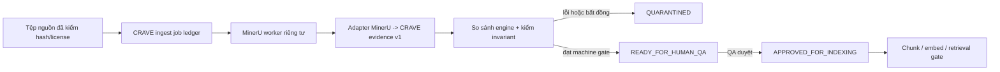

# CRAVE MinerU Scan Pipeline

Status: `SOURCE_ONLY — NOT DEPLOYED`  
Action: `R08-A01`  
Scope: scan PDF/image, OCR, layout, table, formula, figure and reading order

## 1. Quyết định kiến trúc

CRAVE nên bổ sung MinerU như một **worker phân tích tài liệu có phiên bản**, chạy
trong vùng riêng và chỉ ghi vào staging. MinerU không phải nguồn sự thật, không
được tự duyệt nội dung GMP và không được nối trực tiếp Markdown/JSON đầu ra vào
`document_chunks`, embedding hoặc `hybrid_search_v3`.

Vai trò đích:

MinerU giải quyết khoảng trống hiện tại của CRAVE ở layout, reading order,
header/footer, bảng, công thức, ảnh/biểu đồ và OCR đa ngôn ngữ. Cơ chế ba engine,
crop/hash, kiểm số/đơn vị và human QA hiện có vẫn là lớp quyết định cuối.

## 2. Cơ sở lựa chọn phiên bản

Candidate được khóa cho spike là tag `mineru-3.4.0-released` phát hành ngày
2026-06-18. Bản 3.4 nâng pipeline OCR lên PP-OCRv6, công bố cải thiện OCR khoảng
11% và tăng tốc pipeline OCR khoảng 100% trên OmniDocBench v1.6. Đây là số liệu
do dự án MinerU công bố, chưa phải bằng chứng hiệu năng trên tài liệu GMP tiếng
Việt của CRAVE.

Không dùng `latest` trong worker. OQ phải lưu tag, package lock, model identifiers,
config hash và hash image/wheel đã cài. Nâng phiên bản tạo adapter/OQ run mới; không
ghi đè evidence cũ.

Nguồn chính thức:

- Repository và changelog 3.4: <https://github.com/opendatalab/MinerU/tree/mineru-3.4.0-released>
- Yêu cầu cài đặt: <https://opendatalab.github.io/MinerU/quick_start/>
- API/queue: <https://opendatalab.github.io/MinerU/usage/quick_usage/>
- Định dạng output: <https://opendatalab.github.io/MinerU/reference/output_files/>
- License: <https://github.com/opendatalab/MinerU/blob/master/LICENSE.md>

## 3. License và data-governance gate

MinerU 3.4 dùng MinerU Open Source License, dựa trên Apache 2.0 nhưng có điều
kiện bổ sung. Nếu cung cấp dịch vụ trực tuyến cho bên thứ ba dựa trên MinerU thì
phải hiển thị attribution rõ ràng; ngưỡng thương mại rất lớn trong license vẫn
phải được Legal/Owner ghi nhận thay vì suy diễn là Apache 2.0 thuần.

Quy tắc CRAVE:

1. spike chỉ chạy local/private với fixture không nhạy cảm hoặc tệp đã được owner
   cho phép;
2. không upload SOP/GMP lên demo, cloud API hay model endpoint bên ngoài;
3. tắt `llm-aided-config` vì nó có thể gọi OpenAI-compatible service ngoài và tạo
   thêm secret/data-egress không nằm trong change-control hiện tại;
4. model source chỉ được download trong bước tooling riêng; production phải dùng
   model cache/registry đã kiểm hash;
5. trước production phải có Software Bill of Materials, license notice và quyết
   định attribution.

## 4. Backend và phần cứng

Máy hiện tại là macOS 15.3 ARM64, có khoảng 64 GiB dung lượng đĩa trống, nhưng
Python hệ thống là 3.9.6; MinerU yêu cầu Python 3.10–3.13. `uv`, Docker và MinerU
chưa có. Docker MinerU không phải đường cài được khuyến nghị trên macOS.

Spike đầu tiên dùng môi trường `uv` tách biệt và backend `pipeline` vì hỗ trợ CPU,
ít rủi ro hơn và không tạo phụ thuộc API ngoài. Tài liệu chính thức yêu cầu tối
thiểu 16 GiB RAM, khuyến nghị 32 GiB và khoảng 20 GiB SSD cho lane local; phải
đo RAM thực tế trước khi cài. `hybrid-engine` chỉ được benchmark sau khi pipeline
đã chạy ổn và tài nguyên đủ. Với hybrid 3.3+, `effort=high` mới phù hợp lane cần
image analysis; `medium` không được dùng để tuyên bố đầy đủ ảnh/biểu đồ.

Không cài model trong R08-A01. Cài dependency/model là R08-A02 riêng với byte
budget, cache path, cleanup và approval tooling phù hợp.

## 5. Job ledger và API boundary

MinerU 3.x có `/health`, `POST /tasks`, `GET /tasks/{task_id}` và endpoint result.
Tuy nhiên task state chỉ nằm trong process, không bền qua restart/reload hoặc
multi-process. Vì vậy:

- CRAVE job ledger mới là nguồn trạng thái canonical;
- MinerU `task_id` chỉ là execution reference;
- idempotency key là `document_version_id + raw_sha256 + page_window + parser_lock_hash`;
- restart phải reconcile output directory/hash rồi mới retry;
- output thiếu hoặc task biến mất chuyển `RETRYABLE_LOST_WORKER_STATE`, không được
  suy ra parse thành công;
- n8n chỉ điều phối manifest/reference nhỏ, không mang PDF/base64 hoặc ảnh DPI cao
  qua chuỗi node dài.

Service không được public Internet. Nếu cần auth/gateway hoặc credential mới,
đó là change-control riêng; không thêm credential n8n thứ ba trong source-only
contract này.

## 6. Adapter output có phiên bản

Không lấy Markdown làm canonical input cho indexing. Adapter `crave-mineru-v1`
nhận output MinerU đã khóa phiên bản và tạo evidence chuẩn hóa theo trang/block.

Artifact đầu vào:

- `middle.json`: nguồn cấu trúc chi tiết ưu tiên;
- `content_list.json`: nguồn tiêu thụ đơn giản để đối chiếu;
- `model.json`: raw inference/debug khi backend cung cấp;
- `layout.pdf` và `span.pdf`: QA trực quan khi backend cung cấp;
- ảnh/table/figure crops kèm hash.

`content_list_v2.json` được MinerU mô tả là định dạng mới từ 3.0 nhưng vẫn ở trạng
thái development/subject to change. CRAVE chỉ giữ nó làm evidence phụ trong
R08-A01; không dùng làm contract production cho đến khi schema pin và compatibility
fixtures đạt OQ.

Adapter bắt buộc ghi:

- MinerU version/tag, backend, method, effort, model IDs và config hash;
- source SHA-256, document version, page range, page size, rotation và render DPI;
- raw bbox + coordinate system ban đầu;
- bbox CRAVE chuẩn hóa `[0, 1000]`, có kiểm range và không đảo trục;
- block type, reading order, text/table/formula/image/chart content;
- raw artifact paths/hashes và source-crop hashes;
- warning, skipped/broken page, confidence/anomaly và cleanup state.

Pipeline và VLM có khác biệt về cấu trúc/coordinate system. Adapter phải reject
backend/version không biết thay vì đoán. Mọi block accepted phải trace ngược về
đúng trang và vùng nguồn.

## 7. Windowing và tài nguyên

- một file mỗi ingest job;
- một page window mỗi worker task, mặc định 10 trang;
- scan triage ở 150 DPI; OCR production 300 DPI; chỉ retry trang tranh chấp ở
  400 DPI;
- timeout, RSS, wall time, output bytes và model cache hit phải được đo;
- vượt quota hoặc thiếu đĩa chuyển `QUARANTINED_RESOURCE_LIMIT`;
- không xóa raw/output tạm cho đến khi hash/evidence/cleanup checkpoint hoàn tất;
- file trên 50 MiB hoặc archive tiếp tục dùng lane heavy riêng hiện có.

Sliding-window nội bộ của MinerU 3.x giúp giảm peak memory, nhưng không thay thế
quota/page-window và resume checkpoint của CRAVE.

## 8. Accuracy và promotion gate

MinerU là một engine độc lập trong ma trận so sánh, không phải engine thứ nhất
được ưu tiên mặc định. Với nội dung GMP-critical:

1. đối chiếu MinerU với ít nhất hai đường độc lập phù hợp loại tài liệu;
2. so sánh exact numbers, signs, decimal separators, units, section references,
   table cells/spans và diagram labels;
3. phát hiện missing region, reading-order crossing và unanimous-but-wrong bằng
   invariant/crop review;
4. bất đồng critical chuyển `READY_FOR_HUMAN_QA` hoặc `QUARANTINED`;
5. chỉ reviewer có danh tính mới được duyệt;
6. approval của parser không bao giờ tự đặt `approved_for_ai_use=true`;
7. sau QA vẫn phải qua current-version, license, chunk, embedding và retrieval
   gates hiện hành.

## 9. OQ benchmark đề xuất

R08-A02 dùng năm fixture không nhạy cảm:

1. PDF text-layer nhiều cột;
2. PDF scan tiếng Việt có dấu, số và đơn vị;
3. bảng có merged cells/footnotes;
4. sơ đồ có nhãn/mũi tên;
5. trang xoay hoặc PDF lỗi có kiểm soát.

Gate tối thiểu:

- 5/5 trả manifest hoặc lỗi được phân loại fail-closed;
- cùng input/config tạo cùng normalized evidence hash;
- 100% accepted block có page+bbox+source hash;
- 0 critical number/unit/reference tự được promotion khi engine bất đồng;
- table shape/cell mapping được so với crop ground truth;
- corrupted/password input không tạo chunk;
- mất task state/restart không tạo duplicate;
- đo peak RSS, wall time, output bytes và cleanup residue;
- không có network egress ngoài model-download step đã tách riêng.

## 10. Lộ trình triển khai

### R08-A01 — hoàn thành trong source

- kiến trúc này;
- contract machine-readable;
- static regression cho fail-closed/data-egress/versioning/license gates.

### R08-A02 — local spike, cần quyết định tooling riêng

- tạo Python 3.12/`uv` env cô lập;
- pin MinerU 3.4.0 + lock/hash;
- tải model có byte budget;
- chạy five-fixture OQ bằng `pipeline`, rồi cân nhắc `hybrid-engine`;
- lưu report tài nguyên và compatibility adapter.

### R08-A03 — staging schema/source-only

- thiết kế `ingest_jobs`, parse artifacts, page/block evidence, disagreements và
  review decisions với RLS/audit append-only;
- migration/rollback/test riêng; chưa apply.

### R08-A04 — Workflow P/WF-01 source-only

- n8n chỉ tạo/reconcile job manifest và nhận compact result reference;
- giữ Cách B JWT khi có webhook, không crypto/community node/Variables;
- không thêm credential ngoài change-control.

### R08-A05 — controlled live gate

Chỉ sau OQ + schema/workflow source + CODEX SELF-REVIEW. Mọi Supabase apply/write,
n8n update/execute/publish và production indexing phải xin approval exact change
set riêng.

## 11. Không thuộc R08-A01

- cài MinerU/model;
- gửi tài liệu lên mineru.net/demo/cloud;
- tạo API public;
- sửa hoặc chạy workflow n8n;
- tạo/apply migration hoặc ghi dữ liệu Supabase;
- chunk/embed/index bất kỳ output MinerU;
- bật production retrieval;
- Git commit/push/PR.
