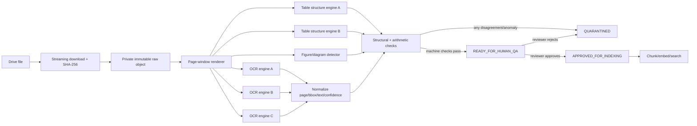

# CRAVE multimodal ingest validation

Status: `SOURCE_ONLY — NOT LIVE`  
Owner: Codex GPT  
Applies to: scanned PDFs, tables, figures, diagrams and OCR-derived text used by CRAVE

## 1. Accuracy contract

Automation alone cannot prove absolute correctness. Three engines may agree on the
same wrong answer because they share a low-resolution input, common training bias or
the same damaged source. CRAVE therefore defines the operational equivalent of
"absolute accuracy" as a zero-tolerance, fail-closed promotion process:

1. preserve the original binary hash and the exact page/crop coordinates;
2. run at least three independent OCR/layout paths for scanned GMP material;
3. compare text, numbers, units, section references, table structure and geometry;
4. reject automatic promotion on any critical disagreement or anomaly;
5. require a human reviewer to compare critical GMP content with the source image;
6. keep the reviewer identity, decision, engine/model versions and all evidence;
7. only then promote the staged version for chunking, embeddings and retrieval.

An engine confidence score is evidence, not truth. A 2-of-3 vote may create a review
candidate, but it may not approve a critical number, unit, table cell or diagram label.

## 2. Processing architecture

The n8n workflow is an orchestrator, not a large-binary workbench. It passes private
object references, page ranges, hashes and compact JSON. OCR workers read one bounded
page window at a time and write results to staging. Raw PDF bytes and high-resolution
page images must not be carried through long n8n item chains.

## 3. Mandatory normalized evidence

Every extracted item must carry:

- `document_version_id`, raw/content SHA-256 and source object version;
- page number, page dimensions, rotation, DPI and renderer version;
- element type: `text`, `table`, `picture`, `diagram`, `formula` or `unknown`;
- normalized bounding box plus an immutable source-crop hash;
- engine/model/version, preprocessing variant and per-engine confidence;
- raw engine output, normalized output and comparison decision;
- validation rules applied, disagreements and anomaly codes;
- lifecycle state and, when approved, reviewer/review timestamp.

Only staging may accept machine output. Existing production document versions,
chunks and embeddings are not a staging area.

## 4. OCR consensus and disagreement handling

For scanned GMP pages, use three independent model families. The R05-A06 prototype
used Tesseract 5.5.2, RapidOCR 1.4.4 and EasyOCR 1.7.2. Production candidates may be
replaced after a versioned benchmark, but must remain genuinely independent.

Normalize Unicode, whitespace, hyphenation and reading order before comparison, but
preserve the untouched output. Compute at minimum:

- normalized character disagreement rate;
- word/token overlap and unmatched line regions;
- exact numeric/unit token sets;
- section/cross-reference agreement;
- bounding-box overlap and reading-order agreement;
- mean and low-tail confidence by engine.

Fail closed when any of the following occurs:

- a number, decimal separator, sign, exponent, percentage or unit differs;
- a section/table/figure reference differs;
- any engine omits a source region containing text;
- text confidence is below the benchmark threshold;
- reading order crosses columns, boxes or flowchart arrows incorrectly;
- a page expected to contain content returns empty or implausibly short output.

Disagreement triggers one controlled retry at a higher resolution and with a second
preprocessing variant. If disagreement remains, the page becomes `QUARANTINED` and
requires human review; it is never silently resolved by majority vote.

## 5. When all tools agree but all are wrong

n8n must apply checks that are independent of OCR consensus:

- source integrity: raw hash, page count, expected dimensions and duplicate detection;
- document invariants: title/standard number/date/section sequence and repeated headers;
- domain invariants: known unit vocabulary, plausible value ranges and decimal rules;
- table invariants: row/column consistency, totals, percentages, footnote markers and
  header/body alignment;
- layout invariants: every accepted token must map back to a visible source region;
- cross-page invariants: continued tables, repeated headers and section continuity;
- retrieval safety: unreviewed output is excluded from approved chunks and search;
- source-image review: critical values and tables require visual reviewer sign-off.

For GMP-critical pages, two-person verification is recommended: one reviewer enters or
approves the result and a second reviewer independently verifies it. This is the only
defensible protection against a confident, unanimous machine error.

## 6. Tables: extraction, validation and dashboard rendering

Table validation requires a page that actually contains a table. The R05-A06 sample
pages 1, 9 and 18 contain no table, so that action cannot claim a table benchmark.

The production table path must compare at least three outputs appropriate to input:

1. Docling/TableFormer in accurate mode for layout and cell structure;
2. a second structure path such as PaddleOCR PP-Structure or img2table;
3. a PDF-native path such as pdfplumber/Camelot when a trustworthy text layer exists,
   or a third scan-layout model when it does not.

The canonical table object stores table/page/crop hashes, bounding box, row and column
counts, header hierarchy, cell row/column spans, cell text, units, footnotes and each
engine's cell mapping. Structural agreement is checked separately from text agreement.

The web dashboard renders this verified JSON with React table components; it must not
inject engine-produced HTML. The result view includes:

- a responsive, accessible table with merged-cell and multi-row-header support;
- a `Xem bản gốc` control showing the exact page crop beside the structured table;
- highlighted cells for any unresolved or historically corrected discrepancy;
- page/document/version citations and approval status;
- CSV/XLSX export only from the approved canonical cell matrix.

R05-A08 added a concrete page-7 benchmark with both a formal technical table and a
numbered equipment diagram. The important result is fail-closed, not automatic
approval: pdfplumber native-line and Camelot lattice agreed on a `14x4` candidate
matrix, but text-strategy extraction, Docling/TableFormer and PaddleOCR PP-TableMagic
disagreed materially (`17x6`, `17x2`, `13x4`, `9x4`, `8x4`). Workflow P must therefore
stage such pages as review candidates with exact source crops, not write approved
chunks. The dashboard must show the candidate table beside the source crop and mark
engine-disagreed rows/cells until a human reviewer resolves the structure and text.

Docling's current document model represents tables, pictures, layout bounding boxes and
provenance, and its figure-export example can preserve page, table and picture images.
These capabilities make it a useful candidate, not an authority: CRAVE still compares
its result with independent paths and source crops.

## 7. Figures, diagrams and visual similarity

For every accepted picture or diagram, preserve a private original crop and thumbnail,
document version, page/bbox, binary hash, element class, OCR labels, caption and nearby
context. Flowchart labels are validated as critical text; topology such as nodes, arrows
and decision branches is stored separately from the caption.

Visual similarity is a separate retrieval lane:

1. generate a versioned image embedding from the approved crop;
2. store it under the same document-version, license and approval gates as text;
3. search within approved assets only;
4. return a signed/private thumbnail reference, page citation and similarity score;
5. allow the user to open the source-page crop and the containing document.

Text similarity, caption similarity and image similarity remain separate scores. CRAVE
must not claim two diagrams are equivalent merely because their visual vectors are
nearby.

## 8. n8n fail-closed state machine

Allowed states are:

`RECEIVED -> HASH_VERIFIED -> RENDERED -> OCR_COMPLETE -> VALIDATED -> READY_FOR_HUMAN_QA -> APPROVED_FOR_INDEXING`.

Any exception, timeout, missing branch, schema violation, disagreement, suspicious
unanimous result or reviewer rejection transitions to `QUARANTINED`. No transition may
skip `VALIDATED` or `READY_FOR_HUMAN_QA`. The final production-write node must assert:

- all required engine branches returned the same raw/page hash;
- result counts match expected pages/elements;
- all critical numeric/unit/table/diagram checks passed;
- source crops exist and their hashes match;
- human approval exists for GMP-critical content;
- the document version is current, licensed and approved for AI use.

If any assertion is false or missing, the node emits an audit event and writes no
production content.

## 9. Heavy-book scaling plan

- Download each approved file once by streaming to private temporary/object storage;
  compute SHA-256 during the stream.
- Process one heavy file at a time. Use 10–25-page windows and resume checkpoints.
- Triage at 150 DPI; use 300 DPI for production OCR, 300–400 DPI for tables and small
  labels, and retry only disputed pages at 400 DPI.
- Run three OCR paths on scanned pages during the one-time controlled ingest. Do not run
  three full-document in-memory branches inside n8n.
- Limit worker concurrency and memory by page window; store compact JSON between nodes.
- Delete temporary binaries and page images only after hashes, evidence and cleanup
  verification succeed. Keep approved source crops in private governed storage.
- Archives and files above 50 MiB use a separate extraction/quota lane.

## 10. Change-control boundary

This document is design-only. Implementing it requires separate approval for schema
migrations, Supabase writes, n8n workflow update/execution and any embedding backfill.
No current P0 blocker is closed by this design alone.

## 11. MinerU scan/layout worker candidate

R08-A01 bổ sung MinerU 3.4.0 như một candidate engine cho scan/OCR/layout,
reading order, bảng, công thức và hình ảnh. MinerU chỉ là một đường extraction
trong ma trận đa engine; output luôn đi qua adapter có phiên bản, crop/hash,
invariant checks và human QA. Markdown hoặc JSON do MinerU sinh không được nối
thẳng vào chunk, embedding hay retrieval.

Thiết kế chi tiết, license/data-egress gate, durable job ledger, output adapter,
OQ fixtures và lộ trình nằm tại
[`crave-mineru-scan-pipeline.md`](crave-mineru-scan-pipeline.md). Contract
machine-readable nằm tại
`n8n/workflow-contracts/TKTL-R08-mineru-scan-worker.contract.json`.

## References

- <https://docling-project.github.io/docling/concepts/docling_document/>
- <https://docling-project.github.io/docling/_generated/examples/export_figures/>
- <https://docling-project.github.io/docling/usage/advanced_options/>
- <https://docling-project.github.io/docling/concepts/chunking/>
- <https://github.com/opendatalab/MinerU/tree/mineru-3.4.0-released>
- <https://opendatalab.github.io/MinerU/reference/output_files/>
