# CRAVE Search Upgrade Master Plan — Retrieval V4

**Ngày lập:** 2026-06-29

**Phạm vi ưu tiên:** tìm kiếm tài liệu, RAG retrieval, corpus/index, citation và
retrieval evaluation

**Project Supabase:** `bdttccztjtrcaztjgkot`

**Phạm vi n8n:** chỉ workflow prefix `TKTL` trên `n8n.cpc1hn.com`

**Trạng thái:** **REVISED AFTER CLAUDE CODE REVIEW — PLAN ONLY; chưa cho phép
apply/update/execute/publish/push**

**Nguồn định hướng:** báo cáo `deep-research-report.md` do người dùng cung cấp
ngày 2026-06-29, ghi chú “Đừng để CRAVE trở thành AI trả lời hay nhưng không
chứng minh được nguồn”, và evidence source/live của repo.

**Cross-system contract authority:** `docs/architecture/crave-system-master-plan.md`
và `docs/database/supabase-master-schema-plan.md`. Tài liệu này giữ chi tiết
retrieval; khi tên bảng/data contract mâu thuẫn, master schema mới ưu tiên.

## 1. Quyền ưu tiên của kế hoạch này

Tài liệu này là nguồn canonical cho mọi thay đổi liên quan đến:

- tìm kiếm metadata tài liệu;
- truy hồi chunk cho RAG/agent/copilot;
- query expansion song ngữ Việt–Anh;
- vector embedding, FTS, fusion và rerank;
- quyền truy cập tài liệu trong retrieval;
- citation grounding và fallback khi thiếu nguồn;
- corpus health, reindex và retrieval regression.

Các kế hoạch cũ trong `kehoach.md`, `nangcap.md`, tài liệu Chat 01–20 và tên
workflow minh họa trong báo cáo nghiên cứu chỉ là nguồn tham khảo. Chúng không
được dùng để:

- renumber hoặc đổi tên 14 workflow TKTL đang tồn tại;
- tạo lại bảng đã có với tên mới;
- giữ một thiết kế search đã được live evidence chứng minh là không an toàn;
- bỏ qua change-control, RLS, audit append-only, secret hygiene hoặc phê duyệt
  riêng cho thao tác live.

Khi có mâu thuẫn về thiết kế retrieval, tài liệu này ưu tiên hơn kế hoạch cũ.
Các quy tắc an toàn production vẫn giữ nguyên.

## 2. Kết luận điều hành

Nâng cấp tìm kiếm phải được triển khai như một chương trình **corpus-first và
retrieval-first**, không phải một đợt tăng prompt hoặc thêm agent. Thứ tự đã được
Claude Code review lại là:

1. containment lỗ hổng authorization của WF-06 và đóng băng mở rộng agent;
2. source registry và license gate;
3. logical document + immutable document versioning;
4. Docling parse quality và human review gate;
5. chunk metadata, hash, token và embedding readiness;
6. hybrid search Việt–Anh qua JWT/RLS thật;
7. claim-level citation grounding và retrieval/tool evidence;
8. eval trên 100 golden questions trước cutover;
9. Google Docs draft có review states;
10. chỉ sau đó mới mở rộng controlled agent, AI reviewer hoặc copilot.

Không thêm vector database riêng. Supabase PostgreSQL + pgvector tiếp tục là lõi.
Không dùng LLM làm reranker mặc định P0 vì khó tái lập; P0 dùng candidate pools
độc lập + reciprocal rank fusion (RRF) + metadata boosts có version.

## 3. Evidence hiện trạng — 2026-06-29

### 3.1 Corpus và index live

| Chỉ số | Live | Nhận định |
|---|---:|---|
| Documents | 12 | 11 SOP nội bộ tiếng Việt, 1 guideline tiếng Anh |
| Document codes | 12 distinct | Mỗi row hiện là một mã khác nhau; phù hợp backfill version 1:1 |
| `document_group_id` | 3 giá trị | `GRP-GMP` gom 10 mã khác nhau; không dùng làm logical-version key |
| Rows được đánh dấu superseded | 0/12 | Chưa có evidence vòng đời version |
| Documents `approved_for_ai_use=true` | 12/12 | Corpus nhỏ, phù hợp backfill có kiểm soát |
| Documents có `file_hash` | 0/12 | Không đủ provenance/integrity cho reindex |
| Documents có Drive ID/source URL | 0/12 | Chưa chứng minh raw source lineage |
| Chunks | 65 | 61 internal, 4 regulatory |
| Chunks có `content_tsv` | 65/65 | FTS khả dụng; cột generated bằng config `simple` |
| Chunks có embedding | **0/65** | Vector search hiện không hoạt động |
| Chunks có `content_tokens` | 0/65 | Thiếu capacity/chunk-quality evidence |
| Chunks có page/section/hash | 0/65 | Citation chưa đủ page/section provenance |
| Chunks có `quality_score` | 65/65 | Tất cả là default 1.0; không thay thế parse-quality evidence |
| Glossary terms | **0** | Query expansion song ngữ chưa có nền deterministic |
| Golden questions | 100 | Có nền eval để mở rộng thành retrieval regression |
| `ai_queries` / `ai_query_sources` | 0 / 0 | Citation grounding chưa có evidence vận hành |
| Source/version/retrieval/tool tables | Chưa có | Cần tạo trước khi mở rộng agent |
| pgvector | 0.8.0 | Có thể dùng HNSW iterative scans |
| Embedding column | `vector(1536)` | Khớp mặc định `text-embedding-3-small` |

`content_tsv` là generated column:

```sql
to_tsvector('simple', coalesce(content, ''))
```

Index hiện có:

- GIN trên `document_chunks.content_tsv`;
- HNSW cosine trên `document_chunks.embedding`;
- B-tree cho document/status/language/source/trust/equipment/access.

HNSW hiện không chứa candidate hữu ích vì pgvector không index vector `NULL`.

### 3.2 Lỗi thiết kế của `hybrid_search_v3`

`hybrid_search_v3` hiện:

- là `SECURITY DEFINER`, owner `postgres`;
- chỉ cho `service_role` execute;
- n8n gọi qua direct Postgres credential `GMP-check` dùng role `postgres`;
- role `postgres` live có `BYPASSRLS=true`;
- lấy một candidate set chung rồi `ORDER BY` vector similarity;
- cộng trực tiếp `sim_score * 0.55` vào `combined_score`.

Với toàn bộ embedding đang `NULL`:

- vector similarity là `NULL`;
- FTS vẫn có thể lọc được hàng qua nhánh `OR`;
- candidate ordering theo vector không còn xác định về relevance;
- `combined_score` có thể thành `NULL`;
- kết quả FTS có nguy cơ được trả theo thứ tự không ổn định.

Do đó không được gọi hệ thống hiện tại là hybrid retrieval hoạt động đầy đủ.

### 3.3 Workflow search hiện tại

| Workflow | Hiện trạng liên quan retrieval | Finding chính |
|---|---|---|
| WF-01 Document Ingest | Chunk + gọi OpenAI embedding + tự ghép SQL insert | Live corpus vẫn 0 embedding; thiếu completion/integrity gate |
| WF-02 RAG Query | LLM query expansion, embedding, v3, LLM rerank, answer | Direct Postgres owner; dynamic SQL; rerank không deterministic |
| WF-06 Document Search | Tự nối filter vào `SELECT documents` | P0: dynamic SQL + owner/BYPASSRLS |
| WF-07 Approve Document | Quản lý approval | Chưa có index-readiness gate trước AI approval/cutover |
| WF-08 Health Monitor | Health tổng quát | Chưa kiểm missing embeddings, stale chunks, search latency |
| WF-09 Web Source Ingest | Fetch HTML, chunk, embed, tự ghép SQL | Chưa có source/license registry; parser HTML đơn giản |
| WF-10 Google Drive Sync | Upload + sync log | Chưa tạo deterministic reindex job theo content change |
| WF-11 Literature Search | Europe PMC search/ingest | Chưa có version/license/index-readiness contract chung |
| WF-12 QA Assistant | Postgres tools gọi v3 | Tool chạy bằng owner credential, không dựa vào RLS JWT |
| WF-13 Validation Copilot | Postgres tool gọi v3 | Cùng authorization boundary với WF-12 |
| WF-14 Web Document Search | Tavily external search | Không được trộn web result chưa duyệt vào governed corpus |

## 4. Kiến trúc đích Retrieval V4

```mermaid
flowchart LR
    U["Người dùng đã đăng nhập"] --> J["Verify JWT /auth/v1/user"]
    J --> N["Normalize + validate query"]
    N --> G["Glossary expansion VI–EN"]
    G --> E["OpenAI embedding"]
    E --> R["PostgREST RPC hybrid_search_v4"]
    R --> P1["FTS pool"]
    R --> P2["Vector pool"]
    P1 --> F["RRF + metadata boosts"]
    P2 --> F
    F --> T["Threshold + diversity + top-k"]
    T --> L["Append retrieval run/candidates"]
    T --> C["Citation-grounded generation"]
    C --> V["Claim ↔ chunk validation"]
    V --> A["Vietnamese answer or no-source refusal"]

    S["Approved source registry"] --> D["Logical document"]
    D --> DV["Immutable document version"]
    DV --> Q["Parse quality + human review gate"]
    Q --> X["Chunk + hash + embedding jobs"]
    X --> P1
    X --> P2
```



### 4.1 Authorization boundary

Retrieval RPC phải được gọi qua Supabase REST/PostgREST bằng bearer JWT gốc của
người dùng, sau khi JWT đã được verify theo Cách B. RPC là `SECURITY INVOKER` để:

- `auth.uid()` được thiết lập theo request JWT;
- RLS của `documents`, `document_chunks` và `document_access` thực sự áp dụng;
- n8n không còn dùng `GMP-check`/role `postgres` cho user-facing retrieval;
- không tin `p_user_id` do client gửi.

Direct Postgres credential chỉ được giữ cho các tác vụ backend được kiểm soát như
index job, health/eval và audit function đã được review; không dùng cho search của
người dùng.

### 4.2 Candidate generation

`hybrid_search_v4` phải tạo hai pool độc lập:

1. **FTS pool**
   - query gốc + glossary terms + bản expansion đã neo ý định;
   - document code/title/section/content;
   - pool mặc định 30;
   - không phụ thuộc embedding tồn tại.

2. **Vector pool**
   - chỉ lấy chunk có embedding đúng model/dimension/version;
   - cosine distance;
   - pool mặc định 30;
   - bật HNSW iterative scan phù hợp với pgvector 0.8.0 khi filter làm giảm recall.

Không dùng `OR` trong một candidate query rồi order theo vector như v3.

### 4.3 Fusion và ranking P0

P0 dùng RRF có version, ví dụ khởi điểm:

```text
rrf_score = 1 / (k + fts_rank) + 1 / (k + vector_rank), k = 60
final_score = normalized_rrf
            + exact_document_code_boost
            + title_heading_boost
            + approved_current_boost
            + language_preference_boost
            + quality_score_boost
            + source_trust_boost
            - summary_penalty
```

Mọi trọng số, pool size, threshold và top-k phải thuộc một
`retrieval_profile_version`, không hardcode rải rác trong workflow.

P0 không dùng `gpt-4o-mini` làm reranker mặc định. LLM rerank hiện tại chỉ được
giữ trong shadow experiment có log và không quyết định production ranking. P1 có
thể thử `bge-reranker-v2-m3` sau khi baseline P0 PASS.

### 4.4 Bilingual query expansion

Thứ tự expansion:

1. normalize Unicode/whitespace/case nhưng giữ document code, model, acronym;
2. lookup glossary đã approved;
3. thêm cặp VI–EN, abbreviation và synonym đã duyệt;
4. chỉ khi glossary không đủ mới gọi model rewrite;
5. model output phải giữ query gốc và có giới hạn độ dài/term count;
6. log cả original/normalized/expanded query và expansion source.

Glossary là control có review, không phải dictionary do model tự ghi trực tiếp.

### 4.5 Citation và fallback

Response retrieval thống nhất phải có tối thiểu:

```json
{
  "retrieval_log_id": "uuid",
  "retrieval_version": "v4.x",
  "search_mode": "hybrid|fts_only|no_source",
  "chunks": [
    {
      "chunk_id": "uuid",
      "document_id": "uuid",
      "document_code": "...",
      "document_title": "...",
      "document_version": "...",
      "page_number": 1,
      "section_code": "...",
      "section_title": "...",
      "content": "...",
      "fts_rank": 1,
      "vector_rank": 2,
      "rrf_score": 0.03,
      "final_score": 0.81
    }
  ]
}
```

Generation chỉ được phát biểu claim có `chunk_id` hợp lệ trong candidate đã
selected. Nếu không đủ nguồn:

- trả `search_mode=no_source`;
- không gọi generation, hoặc buộc trả thông báo thiếu căn cứ;
- không tự chuyển sang web result như thể đó là SOP/guideline đã duyệt;
- có thể đề xuất mở WF-14 như một luồng tìm web riêng, gắn nhãn ungoverned.

## 5. Thay đổi Supabase

### 5.1 Bảng giữ lại và chuyển vai trò canonical

| Bảng | Quyết định | Lý do |
|---|---|---|
| `documents` | Chuyển thành logical document/current snapshot | 12 mã hiện đều unique; cần `current_version_id`, không tin `document_group_id` hiện tại |
| `document_chunks` | Giữ, mở rộng | Đã có FTS, vector(1536), metadata và RLS |
| `document_access` | Giữ | Policy hiện đã mô hình user/role/department |
| `ai_queries` | Giữ, mở rộng | Đã là query audit/application record |
| `ai_query_sources` | Giữ, mở rộng nhẹ | Đã có claim/chunk/grounded/citation rank |
| `audit_log` | Giữ append-only | Không tạo bảng audit thay thế |
| `eval_runs`, `eval_results`, `golden_questions` | Giữ, mở rộng | Đã có 100 câu và lịch sử eval |

Tạo `document_versions` trong P0 theo mô hình additive/dual-read. Mỗi một trong 12
document code hiện tại được xem là một logical document và được backfill một
immutable version ban đầu. Không dùng `document_group_id` hiện có làm version key
vì `GRP-GMP` đang gom 10 mã tài liệu khác nhau.

### 5.2 Bảng cần thêm

#### `document_versions`

Immutable provenance record cho từng version:

- `id uuid`, `document_id uuid`, `version_label text`;
- `source_registry_id`, `source_document_id`, `source_url`, `source_updated_at`;
- `effective_date`, `retired_at`, `superseded_by_version_id`;
- `drive_file_id`, `binary_sha256`, `content_sha256`;
- `license_status`, `parse_status`, `parse_quality_score`;
- `parse_engine`, `parse_engine_version`, `parsed_at`, `reviewed_by`, `reviewed_at`;
- `approved_for_ai_use`, `approved_by`, `approved_at`;
- `index_status`, `index_version`, `created_at`.

Unique tối thiểu theo `(document_id, version_label)` và theo content hash khi hash
đã verified. Version row không update nội dung sau approval; thay đổi tạo version
mới và cập nhật `documents.current_version_id` theo change-control.

#### `retrieval_profiles`

Lưu cấu hình ranking bất biến và có phê duyệt:

- `id uuid`;
- `profile_name text`;
- `profile_version text` unique;
- `embedding_model text`;
- `embedding_dimensions integer`;
- `fts_pool_size`, `vector_pool_size`, `final_top_k`;
- `rrf_k integer`;
- `score_threshold numeric`;
- `weights jsonb`;
- `filters jsonb`;
- `status draft|approved|retired`;
- `git_commit`, `approved_by`, `approved_at`, `created_at`.

Không update profile đã approved; tạo version mới.

#### `retrieval_log`

Append-only record cho mỗi lần search:

- `id uuid`;
- `ai_query_id uuid null`;
- `user_id uuid`;
- `profile_id uuid`;
- `workflow_name`, `workflow_version`;
- `query_original`, `query_normalized`, `query_expanded`;
- `expansion_source glossary|model|fallback`;
- `filters jsonb`;
- candidate/selected counts;
- `search_mode`, `no_source_reason`;
- latency breakdown;
- `created_at`.

RLS: user xem run của mình; admin/auditor xem theo policy. Không update/delete.

#### `retrieval_candidates`

Append-only score evidence:

- `retrieval_log_id`;
- `chunk_id`;
- `fts_rank`, `vector_rank`;
- `fts_score`, `vector_score`, `rrf_score`, `metadata_boost`, `final_score`;
- `final_rank`, `selected`;
- `rejection_reason`;
- `created_at`.

Không lưu embedding trong log. Có FK tới chunk và run.

#### `document_index_jobs`

Hàng đợi có lease/idempotency cho parse/chunk/embed/reindex:

- `id`, `document_id`, optional `chunk_id`;
- `job_type`;
- `status queued|leased|succeeded|failed|dead_letter`;
- `idempotency_key` unique;
- `attempts`, `max_attempts`;
- `leased_until`, `worker_id`;
- `input_hash`, `embedding_model`, `embedding_dimensions`;
- `error_code`, `error_summary`;
- timestamps.

Không đưa raw secret hoặc full document content vào error fields.

#### `source_registry` — đầu P0

Là license/provenance gate cho WF-09/WF-11/WF-14 ingest:

- domain/source organization;
- source tier;
- public/curated/deny/metadata-only policy;
- allowed content types;
- seed URLs;
- robots/license requirements;
- trust level mặc định;
- reviewer/approval/effective dates;
- active flag.

Không crawl/ingest chỉ vì URL truy cập được.

Source registry được chuyển lên đầu P0, trước versioning/ingest. Đây là gate bắt
buộc, không còn là hạng mục cuối P0/đầu P1.

#### `tool_call_log`

Append-only evidence cho controlled agent/tool calls: query/run, workflow/tool,
input/output hash hoặc summary được kiểm soát, status, duration, error code và
timestamp. Không lưu secret hoặc raw regulated document không cần thiết.

#### `generated_docs` và `doc_reviews` — tạo trước nhịp Google Docs Draft

Lưu draft, source retrieval run, source version IDs, prompt/model/template
version, review status và approved snapshot hash. AI không được tự tạo trạng thái
approved.

### 5.3 Bảng cần mở rộng

#### `documents`

Thêm theo hướng additive:

- `canonical_url`;
- `current_version_id` FK tới `document_versions`;
- `binary_sha256` — hash raw file nếu raw bytes còn bằng chứng;
- `content_sha256` — hash normalized content;
- `hash_status` (`verified`, `legacy_missing`, `mismatch`);
- `license_status`;
- `source_registry_id`;
- `parse_status`, `parse_quality_score`;
- `index_status`, `index_version`, `index_error_summary`;
- `current_content_verified_at`.

Giữ `approved_for_ai_use` làm cờ canonical; không thêm `allowed_for_ai` trùng nghĩa.
Không bịa `binary_sha256` cho 12 legacy document nếu raw bytes không còn.

#### `document_chunks`

Thêm:

- `chunk_sha256`;
- `document_version_id` FK bắt buộc sau backfill;
- `heading_path` hoặc `section_path`;
- `page_start`, `page_end`;
- `is_table`, `is_ocr`;
- `embedding_model`;
- `embedding_dimensions`;
- `embedding_input_sha256`;
- `embedding_status`;
- `embedded_at`;
- `index_version`.

Backfill `content_tokens` bằng tokenizer/version được ghi nhận, không tiếp tục dùng
ước lượng ký tự chia ba làm evidence chính thức.

#### `glossary`

Giữ tên bảng hiện tại và thêm:

- `term_en`, `term_vi`;
- `abbreviation`;
- `synonyms jsonb`;
- `domain`;
- `do_not_translate`;
- `status draft|approved|retired`;
- `approved_by`, `approved_at`;
- `version`, `source_reference`.

Chỉ row `approved` được dùng trong production expansion. Bảng hiện có 0 row nên
việc mở rộng ít rủi ro hơn tạo một bảng `glossary_terms` song song.

#### `ai_queries`

Thêm:

- `query_normalized`;
- `query_expanded`;
- `retrieval_log_id`;
- `retrieval_profile_version`;
- `search_mode`;
- `no_source_reason`;
- `generation_skipped`.

#### `ai_query_sources`

Thêm nếu cần:

- `retrieval_candidate_id`;
- `final_score`;
- `citation_verified_at`.

Score breakdown chi tiết nằm ở `retrieval_candidates`, không nhân bản toàn bộ.

#### `eval_runs` / `eval_results`

Mở rộng để lưu:

- retrieval profile/version;
- embedding model/version;
- corpus snapshot/hash;
- Hit@1/3/5/8, MRR, Recall@k, nDCG@k;
- permission-denial result;
- bilingual slice;
- no-source refusal slice;
- citation validity/grounding;
- latency p50/p95;
- Git SHA và workflow active version.

### 5.4 Function/RPC mới

| Function | Security | Mục tiêu |
|---|---|---|
| `search_documents_v1` | `SECURITY INVOKER` | Thay direct SQL của WF-06 bằng filter typed + RLS |
| `hybrid_search_v4` | `SECURITY INVOKER`, `STABLE` | Hai candidate pool + RRF + filters + score breakdown |
| `append_retrieval_run_v1` | Definer hẹp, validate caller | Append run/candidate evidence nguyên tử |
| `claim_document_index_jobs_v1` | Definer hẹp cho backend | Lease job có giới hạn và idempotency |
| `complete_document_index_job_v1` | Definer hẹp cho backend | Ghi success/failure, không cho SQL tùy ý |
| `get_corpus_health_v1` | Invoker/admin | Missing hash/embedding/stale-index metrics |

`hybrid_search_v3` không bị drop trong P0; chỉ revoke/deprecate sau khi mọi consumer
đã chuyển và regression PASS.

### 5.5 Index đề xuất

- Giữ GIN `content_tsv` và HNSW cosine hiện có.
- Index partial cho chunk embedding-ready nếu cần sau khi đo `EXPLAIN`.
- Composite indexes theo filter thật: document lifecycle/approved/source/language.
- GIN/trigram cho title/code/glossary chỉ sau khi cài `pg_trgm` và có benchmark.
- Không tối ưu theo suy đoán với corpus 65 chunk; mọi index mới cần `EXPLAIN
  (ANALYZE, BUFFERS)` trên clone/test hoặc query read-only phù hợp.

## 6. Migration roadmap

### Migration 024 — `secure_document_search_boundary`

Mục tiêu: đóng P0 WF-06 ngay, không chờ toàn bộ v4.

- tạo `search_documents_v1` typed, `SECURITY INVOKER`;
- grant execute cho `authenticated`, revoke `PUBLIC`/`anon`;
- giới hạn limit/offset;
- allowlist enum/filter trong DB;
- `include_superseded` chỉ cho role được phê duyệt;
- WF-06 gọi RPC bằng bearer JWT qua PostgREST.

Rollback: drop function và republish previous WF-06 chỉ trong emergency; không
được coi previous direct SQL là trạng thái an toàn lâu dài.

### Migration 025 — `source_registry_and_license_gate`

- tạo `source_registry` và immutable source-policy history nếu cần;
- seed chỉ các nguồn đã có owner/reviewer và policy rõ;
- RLS/least privilege;
- không tự ingest hoặc crawl trong migration.

Rollback: disable registry entries/consumer mới; không xóa provenance đã được
dùng bởi version records.

### Migration 026 — `document_versioning_foundation`

- tạo `document_versions`;
- thêm `documents.current_version_id`;
- thêm `document_chunks.document_version_id` nullable trong giai đoạn backfill;
- backfill 1:1 cho 12 document code hiện tại với trạng thái legacy rõ ràng;
- không suy luận `document_group_id` là version family;
- thêm constraints/indexes sau khi reconciliation PASS.

Rollback trước cutover: bỏ dual-read consumer và giữ legacy columns. Sau cutover,
rollback là compatibility restore; không drop immutable version/citation evidence.

### Migration 027 — `parse_and_index_quality`

- parse status/quality/engine/version;
- chunk hash/page/section/token/embedding metadata;
- `document_index_jobs` có lease/idempotency;
- corpus health RPC và readiness constraints;
- không tạo embedding trong migration.

### Migration 028 — `retrieval_v4_foundation`

- tạo `retrieval_profiles`, `retrieval_log`, `retrieval_candidates`;
- mở rộng `glossary`, `ai_queries`, `ai_query_sources`;
- RLS + append-only guards;
- seed retrieval profile ở trạng thái `draft`.

### Migration 029 — `hybrid_search_v4`

- tạo RPC v4 invoker;
- FTS/vector pools độc lập;
- RRF/profile version;
- filters/lifecycle/version/RLS;
- deterministic score breakdown;
- giữ v3 để rollback/canary.

Rollback: chuyển workflow về compatibility profile/previous active version; drop
v4 chỉ khi không còn dependency và không xóa log.

### Migration 030 — `citation_and_tool_evidence`

- claim/citation verification linkage;
- append RPC cho retrieval run/candidates;
- `tool_call_log` append-only;
- constraints/indexes và retention/export policy;
- không update/delete audit/retrieval/tool evidence tùy tiện.

### Migration 031 — `retrieval_eval_v2`

- mở rộng eval schema/function cho full retrieval v4;
- giữ lịch sử FTS eval cũ;
- score scale thống nhất 0–100 hoặc 0–1, không trộn hai contract;
- không thu hẹp kiểu cột chứa dữ liệu live.

### Migration 032 — `generated_docs_review_states` — chỉ sau eval gate

- tạo `generated_docs`, `doc_reviews` và source version/citation linkage;
- DRAFT/REVIEW/APPROVED state machine;
- AI không có quyền tự approve;
- approved snapshot/hash là evidence bất biến.

Mỗi migration phải có rollback tương ứng trong `supabase/rollbacks/`, SQL exact
được review trước và apply live bằng xác nhận riêng.

## 7. Thay đổi workflow n8n

Không renumber 14 workflow hiện có để khớp blueprint trong báo cáo.

### 7.1 Workflow bắt buộc thay đổi

#### WF-06 — ưu tiên đầu tiên

Đổi từ:

```text
Webhook → Verify JWT → Code build SQL → PG owner SELECT documents
```

thành:

```text
Webhook → Verify JWT → Validate typed filters
        → HTTP PostgREST search_documents_v1 bằng user bearer JWT
        → Sanitize response → Respond
```

Loại bỏ decode JWT thủ công cho authorization và loại bỏ dynamic SQL.

#### WF-02 — retrieval orchestrator chính

- dùng user object từ Verify JWT, không tin decoded payload;
- deterministic glossary expansion trước model expansion;
- OpenAI embedding có model/version/dimension check;
- gọi `hybrid_search_v4` qua PostgREST bằng bearer JWT;
- bỏ `Build Search SQL` và `PG: Hybrid Search` owner path;
- LLM rerank chuyển thành shadow/feature flag, mặc định off P0;
- append retrieval run/candidates;
- generation chỉ nhận selected chunks;
- validate claim/chunk trước response;
- no-source không gọi generation;
- lưu `retrieval_log_id` vào `ai_queries`/audit.

#### WF-01 — ingestion/index correctness

- tạo logical document trước và immutable `document_versions` cho mỗi revision;
- tách ingest record, chunking, embedding job;
- không ghép multi-statement SQL từ content;
- hash bằng Supabase `pgcrypto` hoặc worker được kiểm soát;
- ghi embedding model/dimension/input hash/status;
- fail nếu số embedding khác số chunk;
- document chỉ `index_status=ready` khi mọi required chunk hoàn tất;
- raw PDF/DOCX không được decode như UTF-8 text; kết nối Docling/fallback parser.

#### WF-07 — approval/index gate

- approval không tự đồng nghĩa search-ready;
- approval gắn vào đúng immutable version, không chỉ document logical;
- chỉ cập nhật `documents.current_version_id` sau version/change-control gate;
- chỉ bật `approved_for_ai_use` khi lifecycle và quyền phù hợp;
- enqueue reindex nếu content/version thay đổi;
- không cho version superseded tiếp tục là current retrieval source.

#### WF-08 — corpus/search health

Thêm read-only checks:

- approved/current docs thiếu hash;
- chunks thiếu embedding/content token/index version;
- embedding model/dimension mismatch;
- duplicate current versions;
- stale/failed/dead-letter jobs;
- v4 p50/p95 và no-source rate;
- v3 consumer còn tồn tại.

#### WF-09 — governed web ingest

- bắt buộc source registry/license decision trước fetch/ingest;
- canonical URL + binary/content hash + change detection;
- không dùng regex HTML stripping làm parser chính;
- parse quality gate;
- version-safe upsert + index job;
- không tự ghép SQL từ web content.

#### WF-10 — Drive sync

- biến Drive thành raw source-of-record;
- phát hiện delta theo Drive file ID/revision/hash;
- enqueue parse/reindex idempotent;
- không tạo duplicate version khi content không đổi.

#### WF-11 — literature search/ingest

- search metadata vẫn tách khỏi governed corpus;
- ingest chỉ khi license/public policy PASS;
- DOI/PMID/canonical URL làm dedup keys;
- cùng index-readiness contract với WF-01/WF-09.

#### WF-12 và WF-13 — consumer migration

- phân loại **HOLD_FOR_VALIDATED_USE** cho đến khi version, citation và eval gates
  PASS; không tự unpublish trong bước lập kế hoạch;
- tool retrieval không dùng Postgres owner tool gọi v3;
- gọi v4 bằng bearer JWT/contract chung;
- agent chỉ thấy top selected chunks;
- tool output/citation phải giữ `chunk_id`, version, section/page và score;
- không tự do gọi SQL/HTTP ngoài tool allowlist.

#### WF-14 — external web search boundary

- giữ là external discovery, không phải approved corpus search;
- mọi result phải gắn nhãn web/unverified;
- không đưa trực tiếp vào answer grounded như SOP nội bộ;
- ingest candidate phải đi qua source registry, review và index pipeline.

### 7.2 Workflow mới

#### TKTL WF-15 — Corpus Reindex & Embedding Backfill

Workflow operational, mặc định inactive/manual:

```text
Manual Trigger
→ Claim index jobs theo batch
→ Load chunk + verify input hash
→ OpenAI Embedding (OpenAl)
→ Verify count/dimension/model
→ Parameterized update/complete job
→ Corpus health summary
→ Append audit
```

Yêu cầu:

- batch nhỏ, retry có giới hạn, resume/idempotent;
- không log embedding vector/raw document content;
- không overwrite embedding nếu input hash/model/version không đổi;
- stop khi mismatch hoặc rate-limit kéo dài;
- có dry-run thống kê trước khi write;
- chỉ backfill live sau phê duyệt riêng.

Không thêm WF-16 ở P0. Retrieval regression tiếp tục đặt trong GitHub Actions để
release gate không phụ thuộc một active n8n workflow hoặc credential test mới.

### 7.3 Workflow không thay đổi trực tiếp ở P0

WF-03, WF-04 và WF-05 chỉ cần cập nhật response contract/citation consumer nếu
chúng gọi WF-02; không viết search logic riêng.

## 8. Thay đổi GitHub Actions và eval

Cập nhật `.github/workflows/eval.yml` và scripts để:

- chạy static SQL/JSON/secret/manifest checks;
- kiểm corpus snapshot và embedding completeness;
- chạy retrieval v4 trên 100 golden questions bằng test principal được quản trị;
- có security slice hai user có quyền khác nhau;
- so sánh v3 baseline và v4 candidate;
- lưu report JSON/Markdown có Git SHA, migration, workflow version, profile,
  embedding model và corpus snapshot;
- fail release nếu permission leakage, citation invalid hoặc retrieval regression
  vượt ngưỡng.

Không dùng production service-role để giả lập user authorization test.

## 9. Thay đổi frontend

Frontend không tự search Supabase bằng service key. Tiếp tục gọi webhook nhưng cập
nhật contract:

- `retrieval_log_id`, `search_mode`, `retrieval_version`;
- citation title/version/page/section/chunk ID;
- nhãn nguồn `internal approved`, `public guideline`, `web unverified`;
- trạng thái `no source` rõ ràng;
- filter typed, không gửi string enum tùy ý;
- lifecycle/due-review warning;
- admin diagnostics tùy quyền, không lộ SQL/internal error/vector;
- feedback relevance hữu ích/không hữu ích ở P1.

Files dự kiến: `app/src/types/api.ts`, `app/src/App.tsx`, các panel assistant,
validation, observability và API tests.

## 10. Data backfill/cutover

### 10.1 Legacy data rules

- Không bịa `binary_sha256` cho raw file không còn.
- Có thể tính `content_sha256`/`chunk_sha256` server-side bằng `pgcrypto` trên dữ
  liệu đang có, nhưng phải ghi `hash_status=legacy_content_only`.
- Không đổi nội dung chunk trong cùng bước embedding backfill.
- Mọi update phải ghi job/audit/evidence; audit log chỉ append.

### 10.2 Backfill sequence

1. Snapshot read-only counts/hash/status.
2. Tạo 65 index jobs từ chunk hiện có.
3. Dry-run WF-15: count/model/dimension/token estimate, không write.
4. Chạy batch nhỏ 5–10 chunk.
5. Verify embedding non-null, dimension, input hash, không đổi content.
6. Chạy remaining batches.
7. Corpus gate: 100% required chunks ready hoặc explicit exclusion có owner.
8. Chạy v4 shadow eval.
9. Canary WF-02 cho nhóm test.
10. Cutover WF-02, rồi WF-12/WF-13.
11. Deprecate v3 sau observation window; chưa drop.

## 11. Test plan và release gates

### 11.1 Gate tuyệt đối

- Permission leakage: **0**.
- User không có access không nhận chunk/document restricted: **100% PASS**.
- Missing/invalid JWT không chạy retrieval: **100% PASS**.
- Selected citation trỏ tới chunk/document/version tồn tại và được phép: **100%**.
- Approved/current required chunks có embedding đúng contract: **100%**, trừ
  explicit exclusion đã phê duyệt.
- Source/live workflow/migration/manifest match: **100%**.
- Secret scan: **0 hit**.

### 11.2 Quality gate ban đầu

- Không thấp hơn FTS baseline Hit@5 hiện có `96.55%` trên cùng eligible set.
- Báo cáo Hit@1/3/5/8, MRR, Recall@k, nDCG@k theo toàn bộ và từng slice.
- Citation rate ≥ 95% cho answerable questions.
- No-source refusal ≥ 95% cho bộ câu hỏi cố ý thiếu nguồn.
- Vietnamese-query/English-source slice không regression so với baseline và có
  evidence glossary expansion.
- Mọi threshold được version trong `retrieval_profiles`, không sửa số để “làm xanh”.

### 11.3 Operational gate

- p50/p95 RPC latency được ghi và so với baseline; không chấp nhận regression
  >20% mà không có risk acceptance.
- Retry/backfill idempotent; chạy lại không tạo duplicate chunks/jobs/logical docs.
- Failure không làm document nửa-ready xuất hiện trong production search.
- Rollback/cutover rehearsal PASS trên test/clone hoặc có manual recovery được
  phê duyệt.

## 12. Pha thực thi và điểm dừng

Các pha dưới đây là grouping kiến trúc. Thứ tự thực thi/checkpoint chi tiết và
checklist canonical là R00–R11 tại
`docs/checkpoints/search-upgrade-claude-review.md` và
`docs/checkpoints/search-upgrade/README.md`. Không gộp nhiều rhythm thành một
live approval chỉ vì chúng nằm trong cùng pha kiến trúc.

### Pha 0 — Baseline/freeze

- Chụp corpus/index/function/workflow evidence.
- Chốt golden set/slices và retrieval baseline.
- Không thay live.

**Gate:** baseline reproducible.

### Pha 1 — WF-06 security boundary

- Viết migration 024 + rollback.
- Sửa source WF-06.
- Static test, SQL review, JSON/secret/manifest PASS.
- Dừng xin phê duyệt apply 024.
- Sau PASS, dừng xin phê duyệt update/test/publish WF-06.

**Gate:** direct SQL owner path không còn ở WF-06.

### Pha 2 — Source registry, versioning và corpus repair

- Migrations 025–027 + rollbacks theo từng nhịp nhỏ, không apply gộp.
- Source WF-15.
- Dry-run/backfill plan.
- Dừng trước apply và dừng lần nữa trước backfill live.

**Gate:** corpus health/index readiness PASS.

### Pha 3 — Hybrid Search V4 shadow

- Migrations 028–030 + rollbacks theo từng nhịp nhỏ.
- WF-02 candidate source gọi v4.
- V3/V4 side-by-side eval; chưa cutover production.

**Gate:** security tuyệt đối PASS, quality non-regression PASS.

### Pha 4 — Consumer cutover

- Cutover WF-02 canary.
- Sau observation window, chuyển WF-12 và WF-13.
- Cập nhật WF-03/04/05 consumer contract nếu cần.

**Gate:** source/live graph, JWT, RLS, citation và audit PASS.

### Pha 5 — Ingestion quality

- WF-01/07/09/10/11 theo index job/source registry contract.
- Parser/Docling rollout riêng, không gộp với search function release.

**Gate:** tài liệu mới đi từ raw → parsed → approved → indexed có evidence.

### Pha 6 — Frontend/observability/eval cutover

- UI contract mới.
- Eval v2 và dashboards.
- Deprecation notice cho v3.

**Gate:** release candidate và S-system check GO.

## 13. Rollback/change-control

- Mọi workflow giữ previous active version để republish khi cần.
- V4 rollout theo canary/shadow; v3 không bị drop trong P0.
- Schema P0 chủ yếu additive.
- Không rollback bằng cách xóa `retrieval_log`, `retrieval_candidates`, audit hoặc
  eval evidence.
- Nếu v4 lỗi, chuyển consumer về v3/FTS-safe compatibility mode; corpus backfill
  không bị đảo/xóa nếu embedding đúng content hash.
- Nếu embedding model thay đổi, tạo index/profile version mới; không silently
  overwrite toàn bộ mà không có migration/job evidence.
- Từng thao tác Supabase apply, n8n update/execute/publish và git push cần kế hoạch
  cụ thể cùng xác nhận riêng.

## 14. Những việc không làm trong P0

- Không thêm Qdrant/Milvus/Weaviate.
- Không renumber workflow để giống báo cáo nghiên cứu.
- Không duy trì hai version source of truth sau compatibility window;
  `document_versions` phải trở thành immutable version record canonical.
- Không dùng agent/memory làm audit trail.
- Không dùng LLM rerank làm ranking production duy nhất.
- Không crawl rộng hoặc ingest ISPE/nguồn bị hạn chế chỉ vì URL public.
- Không cho web result chưa review trở thành citation governed.
- Không sửa live migration history để làm đẹp evidence.
- Không gọi user-facing search bằng role `postgres`/BYPASSRLS.

## 15. File/source dự kiến

### Supabase

- `supabase/migrations/024_secure_document_search_boundary.sql`
- `supabase/rollbacks/024_secure_document_search_boundary_down.sql`
- `supabase/migrations/025_source_registry_and_license_gate.sql`
- `supabase/rollbacks/025_source_registry_and_license_gate_down.sql`
- `supabase/migrations/026_document_versioning_foundation.sql`
- `supabase/rollbacks/026_document_versioning_foundation_down.sql`
- `supabase/migrations/027_parse_and_index_quality.sql`
- `supabase/rollbacks/027_parse_and_index_quality_down.sql`
- `supabase/migrations/028_retrieval_v4_foundation.sql`
- `supabase/rollbacks/028_retrieval_v4_foundation_down.sql`
- `supabase/migrations/029_hybrid_search_v4.sql`
- `supabase/rollbacks/029_hybrid_search_v4_down.sql`
- `supabase/migrations/030_citation_and_tool_evidence.sql`
- `supabase/rollbacks/030_citation_and_tool_evidence_down.sql`
- `supabase/migrations/031_retrieval_eval_v2.sql`
- `supabase/rollbacks/031_retrieval_eval_v2_down.sql`
- `supabase/migrations/032_generated_docs_review_states.sql`
- `supabase/rollbacks/032_generated_docs_review_states_down.sql`

### n8n

- sửa WF-01, WF-02, WF-06, WF-07, WF-08, WF-09, WF-10, WF-11, WF-12,
  WF-13, WF-14 theo từng pha;
- thêm `TKTL-WF-15-corpus-reindex.json`;
- cập nhật `n8n/release-manifest.json` và workflow docs.

### Eval/frontend/docs

- `.github/workflows/eval.yml` và scripts/report fixtures;
- `app/src/types/api.ts` cùng các search/citation/observability panels;
- `docs/checkpoints/search-upgrade-claude-review.md`;
- `docs/checkpoints/search-upgrade/README.md` và checkpoint/manifest R00–R11;
- change register, source map, release manifest, runbook và checkpoint tương ứng.

## 16. Quyết định bắt đầu

Hạng mục đầu tiên là **R00 — baseline và containment checkpoint**. Sau khi R00
PASS, hạng mục source đầu tiên là **R01 — migration 024 + source WF-06**. Đây vừa
đóng blocker S1 đã xác nhận, vừa tạo authorization pattern dùng lại cho v4.

Không bắt đầu bằng reranker, crawler hoặc agent. Không backfill embedding live
trước khi có schema job/idempotency và dry-run evidence.
