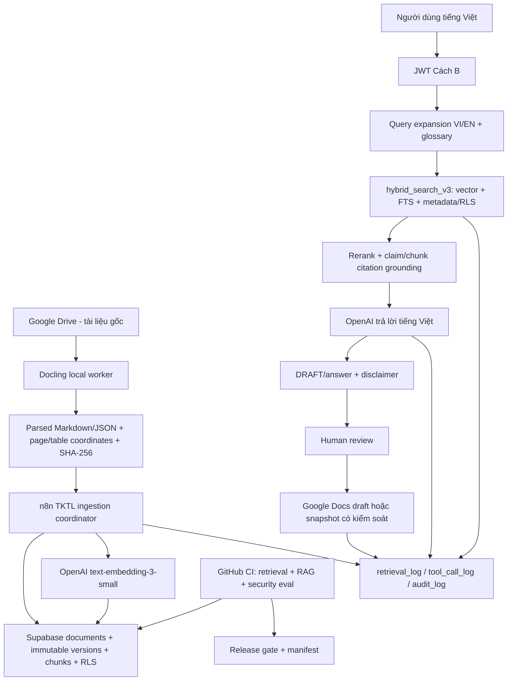

# Kế hoạch nâng cấp CRAVE GMP Validation Intelligence Platform

> Trạng thái: **Roadmap dựa trên kiểm tra thực tế, chưa triển khai thay đổi production**
> Ngày kiểm tra: **2026-06-28 (Asia/Ho_Chi_Minh)**
> Repo: `tienhoandhd-droid/Du_bao_thoi_tiet` — nhánh `main` — commit `8703878ca0700d17edc2fa3424aa77f20b5f78d5`
> Supabase: `bdttccztjtrcaztjgkot`
> n8n: `https://n8n.cpc1hn.com` — chỉ kiểm tra nhóm workflow prefix `TKTL`
> Quyết định credential: **người dùng đã chấp thuận bổ sung credential mới theo quy trình kiểm soát ngày 2026-06-28**
> **Điểm xuất phát thực thi:** Chat 20 (CRAVE Mức 4, eval PASS Hit@5=96,55%) đã hoàn thành trước khi roadmap này được lập; các Chat 01–40 trong `kehoach.md` bắt đầu từ trạng thái đó, không từ zero.

### Thứ tự ưu tiên nguồn của roadmap này

Roadmap áp dụng thứ tự ưu tiên sau để giải quyết mọi điểm không thống nhất:

1. Chỉ dẫn mới nhất của người dùng trong đoạn chat này.
2. Ba tệp đính kèm: checklist hành động, prompt lập kế hoạch và phụ lục nguồn web.
3. Trạng thái live được kiểm tra chỉ đọc trên Supabase, n8n và GitHub ngày 2026-06-28.
4. Source code, handoff và tài liệu đang có trong repo.
5. Skill `$crave-codex-builder` dùng làm hàng rào an toàn và quy trình xây dựng; các con số hoặc quy ước cũ trong skill không được ghi đè yêu cầu đính kèm hay bằng chứng live.

| Điểm xung đột | Dữ liệu cũ/skill | Nguồn ưu tiên và quyết định trong roadmap |
|---|---|---|
| PostgreSQL | Ghi phiên bản 16 | Live là **17.6**; dùng 17.6 trong mọi thiết kế/test |
| Migration kế tiếp | Ghi `013` | Live đã có `022`; migration mới bắt đầu từ **`023`** sau khi reconcile source |
| Credential n8n | Chỉ cho phép hai credential | Người dùng đã cho phép credential mới; thêm `CRAVE-Google-Workspace` theo change control, least privilege và OQ; Tavily là quyết định riêng |
| Blueprint workflow | Gợi ý WF01–WF12 | Live có WF-01–WF-14; giữ nguyên ID live và map đủ 12 chức năng logic, không renumber |
| Docling | Chờ toàn bộ control plane hoàn tất | Checklist đính kèm xếp Docling P0 đầu tiên; làm **local spike từ tuần 1** song song với security/reconcile, chỉ chặn kết nối production cho đến khi gate an toàn PASS |
| Glossary | Checklist tóm tắt để P1 | Prompt chi tiết yêu cầu trong P0; chọn mức nghiêm ngặt hơn: **glossary EN–VI ở P0** |
| Eval framework | DeepEval là tùy chọn | Tệp đính kèm yêu cầu Ragas + DeepEval + Promptfoo; dùng đủ ba nhưng tách lane/PR và vai trò để tránh dependency hỗn loạn |
| Rollback source | `0NN_down.sql` cạnh migration | Cây đích đính kèm có `supabase/rollbacks/`; roadmap chọn thư mục rollback riêng làm quy ước mới và yêu cầu cập nhật skill/CI trước khi áp dụng |
| Migration 023 scope | CLAUDE.md ghi "023 = migration tiếp theo" chung | Roadmap xác định rõ: 023 = `security_eval_hardening` (RPC grants, eval policy, rate/size cap); `version_status` (`confirmed_latest`/`outdated`/`unverified`) và RPC đi vào **024**, không phải 023 |
| Môi trường thực thi | Không đề cập trong tài liệu cũ | Nhóm <10 người, **thuần GitHub web (free), không máy local**; Claude build-thử trong sandbox, giao bản xanh; người dùng upload file + chạy Action + chụp màn hình; xem §19 |

## 1. Kết luận điều hành

CRAVE đã vượt giai đoạn demo: frontend React/TypeScript đang deploy được, 14 workflow TKTL đang active, RLS đã bật trên toàn bộ bảng public, `audit_log` có trigger append-only, `hybrid_search_v3` đã tồn tại và bộ FTS retrieval eval mới nhất đạt Hit@5 96,55% trên 58 câu V/Q.

Tuy nhiên, hệ thống **chưa nên mở rộng ngay sang agent hoặc tự động tạo hồ sơ GMP quy mô lớn**. Năm vấn đề phải xử lý trước là:

1. **Control plane chưa an toàn:** `SUPABASE_SERVICE_ROLE_KEY` đang nằm trong GitHub Actions Variable, repo chưa bảo vệ nhánh `main`, trong khi workflow eval có thể gọi một RPC `SECURITY DEFINER` đang mở cho cả `anon` và `authenticated`.
2. **Source–runtime drift:** production đã tới migration `022` nhưng Git chỉ có tới `021d`; n8n live có 14 workflow nhưng repo chỉ lưu 5 JSON; release manifest vẫn ghi migration `015` và 10 workflow.
3. **RAG hiện chưa có vector corpus:** 65/65 chunk đang có `embedding IS NULL`; kết quả 96,55% hiện là FTS retrieval, không phải bằng chứng về hybrid vector search hay độ trung thực của câu trả lời đầu-cuối.
4. **Provenance tài liệu chưa đạt:** 12/12 tài liệu thiếu `file_hash`, chưa có bảng `document_versions`, chưa có Docling, và bảng `document_access` đang có 0 dòng nên chưa có bằng chứng negative-test về phân quyền tài liệu thực tế.
5. **Audit/citation chưa bao phủ:** production có 3 dòng audit và 4 lần Drive sync nhưng `ai_queries=0`, `ai_query_sources=0`; chưa có `retrieval_log` hay `tool_call_log`.

Thực thi theo **hai làn song song**. Làn an toàn chặn mọi thay đổi production; làn giá trị được phép bắt đầu local ngay để không trì hoãn Docling:

```text
LÀN AN TOÀN — chặn production
P0-A Control plane/secret/branch protection
  → P0-B Git ↔ Supabase ↔ n8n reconciliation
  → P0-C Security/audit/eval RPC hardening

LÀN GIÁ TRỊ — bắt đầu local tuần 1
P0-D Docling local spike + version/hash schema draft
  → sau gate A/B/C: ingest controlled + chunk + embedding
  → P0-E Hybrid retrieval + citation + RLS + glossary
  → P0-F Eval: deterministic + Ragas + DeepEval + Promptfoo
  → P0-G DRAFT/Google Docs + P0-H audit/review/backup
  → P1 Controlled agent / reviewer / dashboard
```

Quy tắc giao nhau: Docling có thể parse bộ mẫu local và tạo manifest ngay từ tuần 1, nhưng không được ghi production, import/publish workflow hoặc sử dụng credential production trước khi P0-A/P0-B/P0-C qua review và người dùng xác nhận thao tác live.

## 2. Phạm vi và phương pháp kiểm tra

Đã kiểm tra ở chế độ chỉ đọc:

- Repo cục bộ, GitHub `main`, GitHub Pages, GitHub Actions, tên biến/secret và branch protection.
- Supabase URL, PostgreSQL version, migrations, bảng/cột/RLS, policy, trigger, function grants, advisor, dữ liệu tổng hợp và eval gần nhất.
- Danh sách 14 workflow TKTL, trạng thái active, `versionId`/`activeVersionId`, node, webhook, JWT Cách B và execution metadata mà MCP còn nhìn thấy.
- Build frontend, cú pháp Python, JSON workflow và `npm audit`.
- Các nguồn chính thức về 21 CFR Part 11, EU GMP Annex 11, dự thảo EU Annex 22, GAMP, Supabase, n8n, Docling, OpenAI và eval.

Không thực hiện:

- Không `apply_migration` hoặc SQL ghi/sửa/xóa production.
- Không update/execute/publish/unpublish/archive workflow n8n.
- Không chạy eval live vì eval hiện ghi thêm dữ liệu vào `eval_runs` và `eval_results`.
- Không đổi GitHub Variable/Secret, không bật branch protection, không commit, không push và không tạo PR.
- Không kiểm tra hay thay đổi workflow ngoài prefix `TKTL`.

## 3. Hiện trạng đã xác minh

### 3.1 GitHub và frontend

| Hạng mục | Hiện trạng thực tế | Đánh giá |
|---|---|---|
| Repo | Public, default branch `main` | Phù hợp GitHub Pages nhưng không được chứa dữ liệu GMP, log nhạy cảm hoặc secret |
| Commit live | `8703878...` | Local `HEAD`, `origin/main` và GitHub `main` khớp |
| Pages | `https://tienhoandhd-droid.github.io/Du_bao_thoi_tiet/`, HTTPS enforced | Đang deploy bằng GitHub Actions |
| Action gần nhất | Deploy Pages thành công trên commit `8703878...` | Build/deploy cơ bản đang xanh |
| Eval Action | Lần gần nhất thành công trên commit `b7e89e4...` | Chỉ là FTS retrieval eval |
| Branch protection | Không có (`HTTP 404 Branch not protected`) | **P0** vì workflow có quyền dùng khóa backend |
| GitHub Secrets | Danh sách rỗng | **P0** |
| GitHub Variables | Có `SUPABASE_URL`, `SUPABASE_ANON_KEY`, `WEBHOOK_BASE`, và **`SUPABASE_SERVICE_ROLE_KEY`** | Ba biến public frontend là hợp lý; service-role key không được để ở Variable |
| Release manifest | Hard-code `migration_version=015` và 10 workflow | Sai trạng thái production `022`/14 workflow |
| Build local | PASS, Vite 5.4.21, 84 modules | Frontend biên dịch được |
| Dependency audit | 2 advisory: 1 high (Vite), 1 moderate (esbuild); bản sửa yêu cầu major upgrade | P1 có test hồi quy riêng, không chạy `npm audit fix --force` |
| Vanilla frontend | `js/app.js` vẫn dùng nhiều `innerHTML`; React artifact mới là bản được deploy | Không phải lỗi live hiện tại, nhưng là rủi ro khi rollback nhầm sang vanilla |

### 3.2 Supabase production

| Hạng mục | Hiện trạng thực tế | Đánh giá |
|---|---|---|
| Project | `https://bdttccztjtrcaztjgkot.supabase.co` | Đúng project mục tiêu |
| PostgreSQL | 17.6 | Tài liệu cũ ghi PostgreSQL 16 cần cập nhật |
| Migration live | `013`, `014`, `015`, `017`–`022` | Git thiếu source/rollback `022`; không có baseline `001`–`012` |
| Bảng public | 33 bảng, tất cả bật RLS | Nền tốt, nhưng policy vẫn cần test âm |
| Edge Functions | 0 | Kiến trúc hiện phụ thuộc n8n/direct Postgres |
| Documents | 12, tất cả `approved_for_ai_use=true` | Cần tách dữ liệu seed/test khỏi controlled corpus |
| File hash | 12/12 thiếu hash | **P0 Data Integrity** |
| Chunks | 65 | Có FTS (`content_tsv`) |
| Embedding | 0/65 có embedding | **P0: vector component chưa hoạt động trên corpus** |
| Document access | 0 dòng | Chưa chứng minh được least-privilege theo user/role/department |
| AI query/citation | `ai_queries=0`, `ai_query_sources=0` | Citation/audit chưa được chứng minh đầu-cuối |
| Audit | 3 dòng, đều `ai_query` | Quá ít so với các thao tác đã thực hiện; audit coverage chưa đủ |
| Drive sync | 4 dòng `synced` | Có bằng chứng sync, chưa có provenance/hash/version |
| Eval | 9 runs, 522 results | Có lịch sử, nhưng schema metric đang dùng lẫn nghĩa |
| Latest eval | 58 câu, Hit@5 96,55%, Hit@1 81,03%, MRR 0,8807, PASS | Đây là **FTS retrieval**, không phải Ragas answer faithfulness |
| Security advisor | 10 WARN | Có lỗi thật cần P0 và một số warning cần phân tích, không được revoke mù |
| Performance advisor | 208 mục: 40 FK thiếu index, 32 RLS initplan, 61 unused index, 74 multiple permissive policies, 1 duplicate index | Chỉ tối ưu sau profiling; không xóa index chỉ vì “unused” trên DB ít tải |
| Version status | Chưa có cột `version_status` trong `documents` | **Chưa triển khai**; thiết kế đặt ở migration 024: giá trị `confirmed_latest`/`outdated`/`unverified`, cột `newer_version_url`, `last_verified_at`, RPC `update_document_version_status()` |

Các security finding quan trọng:

- `run_fts_eval_v1` là `SECURITY DEFINER`, chưa khóa `search_path`, và đang executable bởi cả `anon`, `authenticated`, `service_role`.
- Policy INSERT của `eval_runs` và `eval_results` dùng `WITH CHECK (true)` cho `authenticated`.
- `user_has_role` và `user_has_any_role` cũng bị advisor cảnh báo vì `SECURITY DEFINER` callable. Hai hàm này đang được RLS sử dụng, nên **không được tự revoke** nếu chưa có test chứng minh policy không gãy.
- `hybrid_search_v3` và `write_audit_log` đã được khóa tốt hơn: `anon=false`, `authenticated=false`, `service_role=true`, có `search_path` cố định.
- `audit_log`, `chat_memory`, `session_messages` có trigger chặn `UPDATE/DELETE/TRUNCATE` ở database level.

### 3.3 Khoảng cách schema so với mô hình đích

| Thành phần đích | Production | Quyết định roadmap |
|---|---|---|
| `documents` | Có | Giữ làm logical document/master record |
| `document_versions` | **Chưa có** | Tạo P0, backfill từ `documents` hiện tại |
| `document_chunks` | Có | Bổ sung FK version, parser/embedding/content hash |
| `document_access` | Có nhưng 0 dòng | Seed quyền có kiểm soát và negative-test RLS |
| `ai_queries` | Có | Bổ sung trace/release/latency nếu thiếu |
| `ai_query_sources` | Có | Nâng lên claim-level citation |
| `retrieval_log` | **Chưa có** | Tạo P0 |
| `tool_call_log` | **Chưa có** | Tạo P0 trước khi mở rộng agent |
| `generated_docs` | Chưa có; hiện có `generated_protocols` | Không tạo hai hệ song song; thiết kế migration/generalization |
| `doc_reviews` | Chưa có; hiện có `protocol_reviews` | Generalize hoặc compatibility view |
| `eval_runs`, `eval_results` | Có | Tách loại metric retrieval/RAG/agent/security, không ghi sai nhãn |
| `audit_log` | Có append-only | Mở rộng coverage + export/retention, không mutation |
| `prompt_versions` | Có | Bắt buộc link vào mọi AI output/eval |
| `glossary_terms` | Chưa có; hiện có bảng `glossary` rỗng | Migrate/rename có compatibility view, không để hai bảng cùng nghĩa |
| `equipment_registry` | Có, 2 dòng | Giữ và chuẩn hóa |
| `equipment_relationships` | **Chưa có** | P2 sau khi dữ liệu nền sạch |

### 3.4 n8n live

- Có **14 workflow TKTL**, tất cả active: WF-01 đến WF-14.
- WF-01 đến WF-13 có draft trùng bản publish; **WF-14 có `versionId` khác `activeVersionId`**.
- Không workflow nào có Docling; không có Google Docs draft generator.
- WF-02, WF-12, WF-13 có gọi `hybrid_search_v3`.
- Các workflow JWT chính dùng đúng project và không dùng crypto/Variables/community node. Riêng **WF-14 Verify JWT thiếu `onError=continueErrorOutput`**.
- WF-14 lưu một Tavily key dạng literal trong node `CONFIG`. Đây là secret trong workflow definition, không phải cấu hình không bí mật; cần xóa khỏi workflow và rotate key.
- Nhiều webhook frontend còn CORS `*`: WF-02, WF-06, WF-07, WF-08, WF-12, WF-13, WF-14.
- Execution metadata mà MCP còn nhìn thấy từ 2026-06-01 chỉ có WF-06 (3 success) và WF-08 (27 success). Điều này **không chứng minh** workflow khác chưa từng chạy, nhưng có nghĩa là chưa đủ bằng chứng runtime gần đây để tuyên bố PASS cho toàn bộ 14 workflow.
- Instance n8n có credential của nhiều dự án khác. Roadmap chỉ đánh giá binding TKTL; tuyệt đối không đụng BMS-GMP, VMP, QMSTeam, GMP Kiểm Tạp.

### 3.5 Drift trong repo

- Repo chỉ lưu JSON của WF-03, WF-04, WF-05, WF-10, WF-13 — thiếu 9/14 workflow live.
- Local WF-10 bind credential `kết nối google` (`uqb...`), trong khi handoff mô tả live dùng `Kết nối drive`. MCP đã redaction credential binding, nên phải xác minh ở UI trước khi kết luận bản nào là canon.
- Git thiếu `022_fix_eval_rank_order.sql` và `022_down.sql` dù migration `022` đã chạy production.
- Git không có migrations nền `001`–`012`, nên chưa thể dựng lại database từ source.
- `021b`, `021c`, `021d` không có rollback riêng tương ứng.
- `eval.yml` gọi trực tiếp RPC bằng service-role key và chỉ đo FTS. `scripts/run_eval.py` là harness Ragas đầu-cuối khác nhưng chưa được nối vào CI.
- `eval_results.score_faithfulness` hiện được FTS function dùng để lưu reciprocal rank; `score_relevancy` dùng như cờ hit. Tên cột có thể khiến dashboard hiểu sai đây là Ragas faithfulness/relevancy.

## 4. Kiến trúc đích



Nguyên tắc:

- Google Drive là kho file gốc, không phải audit database.
- Docling chạy local cho tài liệu nhạy cảm; output parse phải có parser name/version và hash.
- Supabase Free tiếp tục đủ cho nhóm dưới 10 người ở giai đoạn này; chưa cần vector DB riêng.
- Mọi AI retrieval đi qua `hybrid_search_v3`; metadata listing thuần có thể dùng endpoint riêng nhưng không đưa nội dung tài liệu vào LLM.
- OpenAI chỉ nhận chunk đã được phê duyệt, có quyền truy cập, và có provenance.
- AI chỉ tạo **DRAFT**; trạng thái approved phải do người có thẩm quyền và quy trình QMS quyết định.
- n8n memory không phải audit trail. Tool/retrieval/audit phải ghi vào bảng riêng.
- Không coi PDF snapshot/hash là electronic signature. Nếu CRAVE trở thành system of record hoặc ký duyệt điện tử, phải có URS/risk assessment/validation riêng cho Part 11/Annex 11.

## 5. Quyết định credential Google/Tavily

### 5.1 Quyết định đã được người dùng chấp thuận

Ngày 2026-06-28, người dùng xác nhận **được phép tạo thêm credential mới theo hướng dẫn kiểm soát**. Roadmap vì vậy chốt phương án tự động hóa có Google OAuth thay cho phương án chỉ đồng bộ thủ công.

Credential CRAVE mục tiêu:

1. `GMP-check` — Postgres backend hiện hữu.
2. `OpenAl` — OpenAI hiện hữu, giữ đúng chữ thường `l`.
3. `CRAVE-Google-Workspace` — credential Google OAuth mới, dùng chung cho Google Drive và Google Docs nếu n8n/Google cho phép cùng một credential với scope tối thiểu.

Không tạo nhiều credential Google cho cùng một mục đích nếu một credential least-privilege đã đáp ứng được cả WF-10 và WF-16.

### 5.2 Điều kiện bắt buộc trước khi tạo credential thật

- Chỉ dẫn mới nhất của người dùng và tệp đính kèm đã ưu tiên hơn quy tắc cũ “chỉ 2 credential”; vì vậy `CRAVE-Google-Workspace` được chấp thuận **về nguyên tắc** trong roadmap. Trước khi bind/publish production, cập nhật `AGENTS.md`, skill `crave-codex-builder`, ADR và checklist review bằng một change-control để tài liệu vận hành không tiếp tục mâu thuẫn. Đây là bước đồng bộ governance, không phải lý do phủ nhận chỉ dẫn mới của người dùng.
- Dùng một Google account/service identity chuyên cho CRAVE, không dùng tài khoản cá nhân chung cho các dự án BMS/VMP/QMS.
- Giới hạn quyền vào thư mục Drive chuyên dụng của CRAVE; ưu tiên scope kiểu `drive.file` nếu node n8n và luồng template đáp ứng, chỉ dùng scope rộng hơn khi có bằng chứng kỹ thuật và QA phê duyệt.
- Chỉ xin quyền Google Docs cần cho create/update DRAFT; không cho AI quyền approve, delete hàng loạt hoặc truy cập toàn bộ Drive nếu không cần.
- Ghi credential owner, purpose, Google Cloud project, OAuth client, scopes, shared folder, ngày tạo, ngày review, quy trình revoke/rotate và tài khoản khôi phục.
- Tạo credential bằng n8n UI/Google OAuth consent; không commit access token, refresh token, client secret hoặc credential export vào repo.
- OQ phải chứng minh: upload/read file đúng folder, tạo Google Docs DRAFT, từ chối folder ngoài phạm vi, revoke credential làm workflow fail-safe, và không lộ token trong execution/log.
- Sau khi tạo, export workflow phải redaction credential binding; Git chỉ lưu credential name/placeholder cần thiết, không lưu secret.

### 5.3 Tavily là quyết định riêng

Quyền thêm Google OAuth **không tự động hợp thức hóa Tavily**. WF-14 hiện chứa Tavily key literal trong CONFIG, nên vẫn phải:

- Xóa literal key khỏi workflow definition và rotate key cũ.
- Nếu tiếp tục giữ WF-14, tạo một credential riêng như `CRAVE-Tavily` chỉ sau security/source-governance review và xác nhận rõ rằng web search nằm ngoài controlled internal GMP corpus.
- Nếu chưa phê duyệt credential Tavily, tắt đường ingest/answer có thể đưa web result chưa review vào nghiệp vụ GMP; không lách bằng CONFIG node hoặc request body.

### 5.4 Trình tự triển khai credential

```text
Change-control cập nhật policy/skill/ADR
  → tạo Google Cloud OAuth client + consent configuration
  → tạo CRAVE-Google-Workspace trong n8n UI
  → bind bản draft WF-10/WF-16
  → test manual/OQ với thư mục sandbox
  → Claude Code review evidence
  → người dùng xác nhận trước update/publish workflow production
```

## 6. Thiết kế dữ liệu đề xuất

### 6.1 Logical document và version bất biến

`documents` giữ danh tính logic:

- `id`, `document_group_id`, `document_code`, `document_title`, `document_type`.
- `owner_department`, `access_level`, `gmp_impact`, `equipment_id`/`equipment_code`.
- `current_version_id`, `lifecycle_status`, `created_at`, `updated_at`.
- Unique logical key được định nghĩa rõ; không tiếp tục dùng một hàng vừa làm document vừa làm version lâu dài.

Cột trạng thái phiên bản bổ sung cho `documents` (thêm ở migration 024):

- `version_status`: enum `confirmed_latest` | `outdated` | `unverified` (mặc định `unverified`; chỉ QA/Admin đổi; AI không được ghi cột này).
- `newer_version_url`: text nullable — URL tài liệu mới hơn nếu `outdated`.
- `last_verified_at`: timestamptz nullable — lần cuối xác nhận status.
- RPC `update_document_version_status(doc_id, status, newer_url)`: SECURITY DEFINER, chỉ grant `service_role` và hàm gọi từ role QA/Admin; ghi audit sau mỗi lần cập nhật.
- Frontend hiển thị badge: 🟢 Mới nhất / 🟡 Chưa xác nhận / 🔴 Đã có phiên bản mới → cảnh báo người dùng trước khi trích dẫn.

`document_versions` mới:

- `id`, `document_id`, `version`, `supersedes_version_id`.
- `source_system`, `source_file_id`, `source_file_path`, `source_url`.
- `file_name`, `mime_type`, `file_size_bytes`, `sha256`, `raw_snapshot_path`.
- `parser_name`, `parser_version`, `parse_status`, `parsed_markdown_path`, `parsed_json_path`, `parse_error`.
- `effective_date`, `expiry_date`, `review_due_date`.
- `status`, `approved_for_ai_use`, `approved_by`, `approved_at`.
- `created_by`, `created_at`; không update nội dung version đã phê duyệt, chỉ tạo version mới.
- Unique `(document_id, version)` và unique hash theo chính sách dedupe phù hợp.

`document_chunks` nâng cấp:

- Thêm `document_version_id` bắt buộc sau backfill.
- `chunk_index`, `chunk_type`, `content`, `content_hash`, `content_tokens`.
- `page_number`, `page_range`, `section_code`, `section_title`, `heading_path`, `bbox_json`, `table_json`.
- `embedding vector(1536)`, `embedding_model`, `embedding_dimensions`, `embedded_at`.
- `parser_name`, `parser_version`, `quality_score`.
- Unique `(document_version_id, chunk_index)`; index FTS và vector được tạo sau khi có dữ liệu thật và đo query plan.

### 6.2 Quyền truy cập

`document_access` nên chuẩn hóa principal:

- `document_id` hoặc `document_version_id`.
- `principal_type`: `user`, `role`, `department`.
- `principal_user_id`, `principal_role`, `principal_department`.
- `can_view`, `can_cite`, `can_export`, `is_active`, `valid_from`, `valid_until`.
- `granted_by`, `reason`, `created_at`.

Mọi test retrieval phải chạy ít nhất hai user khác quyền và chứng minh 0 chunk rò rỉ.

### 6.3 Query, citation và observability

`ai_queries`:

- `trace_id`, `user_id`, `session_id`, `query_original`, `query_normalized`, `query_expanded_en`.
- `filters`, `prompt_version_id`, `model`, `release_id`, `status`.
- `latency_ms`, `input_tokens`, `output_tokens`, `estimated_cost`, `created_at`.

`ai_query_sources`:

- `query_id`, `claim_index`/`claim_text_hash`, `chunk_id`, `document_version_id`.
- `citation_rank`, `vector_score`, `fts_score`, `rerank_score`, `grounded`, `used_in_answer`, `snippet`.
- Một claim nghiệp vụ chỉ được xuất khi có ít nhất một source hợp lệ hoặc bị gắn `UNSUPPORTED/BLOCKED`.

`retrieval_log` mới:

- `trace_id`, `query_id`, `user_id`, `query_hash`, `expanded_query_hash`.
- `embedding_model`, `top_k`, `candidate_k`, `thresholds`, `filters`.
- `candidate_chunk_ids`, `selected_chunk_ids`, score JSON, `latency_ms`, `status`, `error_code`, `created_at`.
- Không lưu raw secret; cân nhắc hash/redact query nhạy cảm theo data-classification.

`tool_call_log` mới:

- `trace_id`, `query_id`, `tool_name`, `tool_version`, `iteration_no`.
- `input_hash`, `output_hash`, `source_chunk_ids`, `status`, `latency_ms`, `error_code`, `created_at`.
- Append-only; max iterations WF-12 từ 3 đến 5.

### 6.4 Draft và review

Không tạo song song hai mô hình cùng nghĩa. Chọn một migration strategy:

- Generalize `generated_protocols` thành `generated_docs`, hoặc tạo `generated_docs` rồi backfill và cung cấp compatibility view.
- Generalize `protocol_reviews` thành `doc_reviews`, hoặc compatibility view tương ứng.

`generated_docs` tối thiểu:

- `id`, `doc_type`, `template_id/version`, `equipment_id`, `created_by`.
- `content_markdown`, `source_chunk_ids`, `prompt_version_id`, `model`, `trace_id`.
- `external_system`, `external_doc_id`, `external_url`.
- `state`: `DRAFT`, `REVIEW`, `APPROVED`, `REJECTED`, `SUPERSEDED`; nếu bảng cũ dùng `IN_REVIEW` thì migration map về `REVIEW` hoặc compatibility view, không duy trì hai nghĩa.
- `snapshot_path`, `snapshot_sha256`, `created_at`; AI không được tự set `APPROVED`.

`doc_reviews` tối thiểu:

- `generated_doc_id`, `reviewer_id`, `decision`, `comments`, `reviewed_at`.
- `reviewed_snapshot_sha256`, `review_checklist_version`.
- Nếu cần electronic signature tương đương chữ ký tay, phải là hạng mục validation riêng; không gắn nhãn Part 11 chỉ nhờ có user/timestamp.

### 6.5 Eval và glossary

- `eval_runs` thêm `eval_type` (`retrieval`, `rag_answer`, `agent`, `security`), Git SHA, migration version, workflow activeVersion IDs, prompt/model/dataset version, thresholds.
- `eval_results` dùng cột đúng nghĩa. Không dùng `score_faithfulness` để lưu reciprocal rank. Retrieval dùng `hit_at_k`, `rank`, `reciprocal_rank`; RAG dùng `faithfulness`, `answer_relevancy`, `context_recall`, `citation_rate`, `grounded_pct`.
- Migrate `glossary` thành `glossary_terms` hoặc giữ tên cũ và tạo compatibility view. Trường cần có: canonical EN, preferred VI, acronym, aliases, definition, do-not-translate flag, source document/version/chunk, status, approved_by/at, version.

### 6.6 Danh mục schema đích bắt buộc

Bảng dưới đây là data contract tối thiểu. Tên cột cuối cùng phải được đối chiếu schema live trước khi viết migration; không được tạo bảng trùng nghĩa chỉ để khớp tên trong sơ đồ.

| Bảng đích | Cột/khóa tối thiểu | RLS và tính bất biến |
|---|---|---|
| `documents` | `id uuid PK`, `document_group_id`, `document_code`, `document_title`, `document_type`, `owner_department`, `access_level`, `gmp_impact`, `equipment_id`, `current_version_id`, `lifecycle_status`, `created_by`, `created_at`, `updated_at`; unique logical business key | User chỉ thấy document có quyền; master record được update có audit, nội dung controlled không nằm trực tiếp ở đây |
| `document_versions` | `id uuid PK`, `document_id FK`, `version`, `supersedes_version_id FK`, Drive/source IDs/path/URL, file metadata, `sha256`, raw/parsed paths, parser name/version/status/error, effective/expiry/review dates, `status`, `approved_for_ai_use`, approver/timestamps; unique `(document_id, version)` | Approved version bất biến; sửa nội dung bằng version mới; chỉ approved/effective version được retrieval |
| `document_chunks` | `id uuid PK`, `document_version_id FK`, `chunk_index`, `chunk_type`, `content`, `content_hash`, token/page/section/heading/bbox/table metadata, `content_tsv`, `embedding vector(1536)`, embedding/parser model/version/timestamps; unique `(document_version_id, chunk_index)` | Không policy mở trực tiếp toàn corpus; quyền kế thừa document/version và kiểm trong retrieval function |
| `document_access` | `id uuid PK`, document/version FK, `principal_type`, principal user/role/department, `can_view`, `can_cite`, `can_export`, validity window, `granted_by`, `reason`, timestamps | Admin/QA cấp quyền; user không tự cấp; positive + negative RLS tests bắt buộc |
| `ai_queries` | `id uuid PK`, `trace_id unique`, `user_id`, session, original/normalized/expanded query, filters, prompt/model/release IDs, status, latency/token/cost, `answer_hash`, timestamps | User thấy query của mình; QA/auditor theo role; không cho client giả `user_id` |
| `ai_query_sources` | `id uuid PK`, `query_id FK`, claim index/hash, `chunk_id FK`, `document_version_id FK`, rank/vector/FTS/rerank score, `grounded`, `used_in_answer`, snippet/hash, timestamps | Append-only theo trace; chỉ source user có quyền; source của claim unsupported phải được ghi rõ trạng thái |
| `retrieval_log` | `id uuid PK`, trace/query/user IDs, query hashes, embedding/model, top-k/candidate-k/threshold/filter, candidate/selected chunk IDs, score JSON, latency/status/error, release/workflow IDs, timestamps | Backend insert-only; không lưu secret/raw sensitive text nếu không cần; user không sửa/xóa |
| `tool_call_log` | `id uuid PK`, trace/query IDs, tool name/version, iteration, input/output hash, source chunk IDs, status/latency/error, workflow/prompt/model IDs, timestamps | Backend insert-only; tool allowlist; append-only; không log credential/token |
| `generated_docs` | `id uuid PK`, doc/template type+version, equipment/user/trace/prompt/model IDs, content/hash, source chunk IDs, state, external Google doc ID/URL, snapshot path/SHA-256, timestamps | Creator tạo DRAFT; reviewer khác creator; AI/service workflow không được set `APPROVED` |
| `doc_reviews` | `id uuid PK`, `generated_doc_id FK`, reviewer, decision, comments, checklist version, reviewed snapshot hash, timestamps | Append-only review decision; role/segregation-of-duties policy; correction bằng review mới, không overwrite |
| `eval_runs` | `id uuid PK`, eval type, dataset/version, Git SHA, migration/workflow/prompt/model/release IDs, thresholds/config, status/start/end, summary JSON | CI/backend ghi; QA đọc; không cho anon/authenticated tùy ý gọi privileged evaluator |
| `eval_results` | `id uuid PK`, `eval_run_id FK`, question/case ID, expected/actual source IDs, hit@k/rank/RR, faithfulness/relevancy/context/citation/no-source/security metrics, latency, status/error | Không dùng chung cột cho metric khác nghĩa; insert-only trong một run; retain raw judge evidence theo classification |
| `audit_log` | `id uuid PK`, `trace_id`, `user_id`, `occurred_at`, action, entity type/ID, input/output hash, prompt/model/source/release/workflow IDs, `details_redacted jsonb`, `created_at` | DB chặn `UPDATE`, `DELETE`, `TRUNCATE`; insert qua function kiểm soát; export/hash/retention và access auditor riêng |
| `prompt_versions` | `id uuid PK`, prompt key/version, template, input schema, intended use, model constraints, status, approved_by/at, content SHA-256, Git SHA, effective/superseded timestamps | Approved prompt bất biến; chỉ version approved được production dùng; thay đổi qua change control |
| `glossary_terms` | `id uuid PK`, canonical EN, preferred VI, acronym, aliases, definition, do-not-translate, domain/status/version, source document/version/chunk IDs, approved_by/at, timestamps | P0; QA/domain owner duyệt; retrieval chỉ dùng term approved/effective; sửa bằng version mới |
| `equipment_registry` | `id uuid PK`, equipment code/name/type, manufacturer/model/serial, location/department, GMP impact/criticality/status, document refs, qualification/requalification dates, version, owner/approver/timestamps | Role-based CRUD có audit; equipment code unique; không để AI tự thay trạng thái qualification |
| `equipment_relationships` | `id uuid PK`, from/to entity type+ID, relation type, effective window, version/status, source chunk ID, approved_by/at, timestamps | P2; edge phải có source và approval; AI chỉ đề xuất edge DRAFT, không tự phê duyệt |

Ràng buộc xuyên bảng:

- Mọi bảng nghiệp vụ có `id uuid`, UTC timestamp, `created_by`/actor khi phù hợp và foreign key thật; index foreign key sau khi đo workload.
- `trace_id` nối `ai_queries` → `retrieval_log` → `ai_query_sources` → `tool_call_log` → `generated_docs` → `audit_log`.
- Mọi AI output/eval phải lưu `prompt_version_id`, model/version, Git SHA/release ID và workflow activeVersion ID có thể truy nguyên.
- Hash dùng SHA-256 trên bytes gốc, parsed artifact, chunk content và snapshot; canonicalization phải được tài liệu hóa để hash tái lập được.
- RLS dùng identity từ JWT/auth context, không nhận `user_id` do request body cung cấp. Function `SECURITY DEFINER` phải khóa `search_path`, revoke `PUBLIC` và có grant tối thiểu.

### 6.7 Thứ tự migration dự kiến sau khi source được reconcile

| Migration | Phạm vi | Điều kiện trước apply |
|---|---|---|
| `023_security_eval_hardening.sql` | RPC grants/search path, eval policies, rate/size cap | Source `022` và baseline đã khớp live; negative tests được review |
| `024_document_versions.sql` | `document_versions`, backfill, version FK/hash/parser fields cho chunks; thêm `version_status`/`newer_version_url`/`last_verified_at` cho `documents` + RPC `update_document_version_status()` | Backfill dry-run đủ 12 document/65 chunk; rollback/data-retention plan được duyệt |
| `025_ai_observability.sql` | `retrieval_log`, `tool_call_log`, trace/release fields, append-only controls | Event matrix, redaction và RLS tests PASS |
| `026_generated_docs_reviews.sql` | Generalize `generated_protocols`/`protocol_reviews`, compatibility view, controlled states | Mapping dữ liệu cũ và segregation-of-duties tests PASS |
| `027_glossary_equipment.sql` | Canonicalize glossary; bổ sung equipment schema; chỉ tạo relationships khi P2 được duyệt | Không còn hai bảng cùng nghĩa; owner/approval/source policy đã chốt |

Mỗi migration có rollback tương ứng tại `supabase/rollbacks/023_down.sql`…`027_down.sql`, idempotent ở mức hợp lý và được thử trên môi trường test. Đây là quy ước đích theo tệp đính kèm; trước pha triển khai phải cập nhật skill/CI/repo convention để không tồn tại hai nguồn rollback. Không migration nào được apply chỉ vì xuất hiện trong roadmap.

## 7. Thiết kế workflow n8n theo trạng thái live

### 7.1 Blueprint logic WF01–WF12 từ tệp đính kèm

Các số WF trong bảng này là **nhãn chức năng của blueprint**, không phải lệnh đổi tên workflow production. Một workflow live có thể chứa nhiều stage logic; capability mới chỉ nhận số runtime mới khi không thể tách an toàn bằng sub-workflow/code package.

| Blueprint logic bắt buộc | Chức năng và đầu ra | Mapping vào hệ thống live / quyết định triển khai |
|---|---|---|
| WF01 — Drive ingest | Phát hiện file mới/sửa/xóa trong folder allowlist; lưu source ID/path/version/hash và idempotency key | WF-10 Google Drive Sync làm transport; WF-01 Document Ingest nhận manifest và điều phối. Không để Drive node tự biến file thành approved corpus |
| WF02 — Docling parse | Parse PDF/DOCX/PPTX/XLSX/image/email thành Markdown + JSON có page/table/heading; ghi parser version/status/error | Thêm WF-15 Docling Parse Orchestrator để nhận kết quả từ worker local; không chạy OCR/Docling nặng trong n8n Code node |
| WF03 — Chunk + embed | Chunk theo cấu trúc, content hash, embedding, version link, approved-only gate | Stage/sub-workflow của WF-01; dùng `OpenAl`, batch/retry/idempotency; không tạo duplicate khi ingest lại cùng hash |
| WF04 — Bilingual search | Chuẩn hóa VI, glossary/query expansion EN, vector + FTS + metadata/RLS, rerank | Retrieval stage của WF-02 RAG Query, bắt buộc qua `hybrid_search_v3`; lưu `retrieval_log` |
| WF05 — Citation answer | Trả lời tiếng Việt; map từng claim đến `chunk_id`/version/page; từ chối khi không đủ nguồn | Answer stage của WF-02; lưu `ai_queries` + `ai_query_sources`; no-source path không gọi là PASS |
| WF06 — Google Docs draft | Tạo URS/DQ/IQ/OQ/PQ/Risk/TM/Deviation/SOP Review ở DRAFT; reviewer workflow; snapshot/hash | WF-03 tạo `generated_docs`; WF-16 Google Docs Draft Export dùng `CRAVE-Google-Workspace`; AI không có transition APPROVED |
| WF07 — Eval runner | Chạy golden 50–100 câu cho retrieval/RAG/agent/security; lưu run/result/release metadata | Canonical runner nằm trong GitHub CI/local để có reproducibility; n8n chỉ có thể làm manual trigger/status coordinator, không chứa evaluator duy nhất |
| WF08 — Audit logger | Ghi query/retrieval/tool/draft/review/export với trace và hash; append-only | Shared database function/sub-workflow gọi từ mọi flow. **Không đổi live WF-08 Health Monitor thành audit logger** vì sẽ phá contract hiện hữu |
| WF09 — Glossary updater | Đề xuất/duyệt term EN–VI, acronym, aliases, source/version; chỉ term approved đi production | Sub-workflow controlled mới, dự kiến WF-17 nếu cần webhook riêng. **Không dùng live WF-09 Web Source Ingest** làm glossary updater |
| WF10 — Equipment copilot | Tra equipment registry/documents/qualification context, trả answer/draft có source | Map vào live WF-13 Validation Copilot; live WF-10 vẫn là Drive Sync |
| WF11 — AI reviewer | Soát protocol/draft, finding có severity/source/checklist; chỉ khuyến nghị | Nâng cấp live WF-04 Check Protocol; reviewer AI không thay human reviewer/QA |
| WF12 — Controlled agent | Tool allowlist, 3–5 vòng tối đa, citation/no-source/audit, không HTTP/shell tự do | Map trực tiếp live WF-12 Controlled AI Agent; chỉ mở rộng sau P0 và eval/red-team PASS |

Do đó, traceability matrix phải lưu đồng thời `logical_capability`, n8n workflow ID, `versionId`, `activeVersionId`, webhook path, Git JSON path và release manifest. Cách này đáp ứng đủ blueprint đính kèm mà không làm đứt 14 workflow đang live.

### 7.2 Mapping 14 workflow đang live

Không đổi số WF-01–WF-14 đang chạy chỉ để khớp một sơ đồ mới. Đổi số sẽ làm đứt webhook, frontend, tài liệu OQ và traceability. Thay vào đó giữ ID live và map capability:

| Workflow live | Vai trò đích | Nâng cấp chính |
|---|---|---|
| WF-01 Document Ingest | Ingestion coordinator | Nhận Docling manifest, idempotency, version/hash, chunk + embedding, parse error log |
| WF-02 RAG Query | Bilingual hybrid answer | Query expansion VI/EN, glossary, `hybrid_search_v3`, rerank, claim-level citation, retrieval log |
| WF-03 Draft Protocol | DRAFT generator | Chỉ dùng source chunks hợp lệ, template version, tạo `generated_docs` |
| WF-04 Check Protocol | AI reviewer | Mọi finding có source; chỉ gợi ý, không thay QA |
| WF-05 Calculation Helper | Controlled calculation | Formula version, deterministic calculation, AI chỉ diễn giải |
| WF-06 Document Search | Metadata search | Không đưa raw document content vào AI; parameterized query |
| WF-07 Approve Document | Human governance | Role lấy từ DB, state machine, audit; không cho AI approve |
| WF-08 Health Monitor | Health/observability | Auth hoặc dữ liệu tối thiểu, cache/rate limit, không gọi OpenAI mỗi request |
| WF-09 Web Source Ingest | Curated external ingest | Chỉ nguồn allowlist, status indexed, bắt buộc human review |
| WF-10 Google Drive Sync | Drive transport | Dùng `CRAVE-Google-Workspace` sau change-control/OQ; provenance/hash/version |
| WF-11 Literature Search | Literature source | Không tự biến web result thành approved source |
| WF-12 Controlled AI Agent | Agent hẹp | Tool allowlist, max 3–5, `tool_call_log`, không HTTP/shell tự do |
| WF-13 Validation Copilot | Equipment/VQ copilot | Session ownership, citations, glossary/equipment context |
| WF-14 Web Document Search | Uncontrolled web search | Tách khỏi GMP corpus, bỏ literal secret, JWT Cách B chuẩn, draft=published |

Workflow mới chỉ thêm khi thực sự cần:

- **WF-15 Docling Parse Orchestrator:** nhận manifest từ worker local, không chạy Docling nặng trong Code node n8n.
- **WF-16 Google Docs Draft Export:** chỉ sau khi credential governance và OAuth OQ PASS; nhận `generated_docs` ở trạng thái DRAFT và ghi `external_doc_id/url`.
- **WF-17 Glossary Updater:** chỉ thêm khi glossary cần webhook/review flow độc lập; nếu không, giữ như sub-workflow không public webhook.
- Eval chính chạy trong GitHub CI/local, không cần thêm WF n8n chỉ để chạy Ragas/DeepEval/Promptfoo.

## 8. Danh sách nâng cấp ưu tiên

### P0 — bắt buộc làm trước

P0 chạy theo hai làn: P0-D local spike bắt đầu ngay tuần 1; P0-A/B/C chạy song song và là gate trước mọi ghi production. Sau gate mới nối Docling vào P0-D production ingestion.

| ID | Hạng mục | Lý do |
|---|---|---|
| P0-D0 | Docling local spike trên 5 file đại diện | Bắt đầu đúng ưu tiên tệp đính kèm và sớm khóa parser/manifest/chunk strategy mà không đụng production |
| P0-A | Secret, branch protection, release permission | Ngăn key backend bị lạm dụng hoặc exfil qua workflow thay đổi trực tiếp |
| P0-B | Reconcile Git/Supabase/n8n | Không thể validate/rollback khi source không đại diện production |
| P0-C | Security migration cho eval/audit | Đóng RPC `SECURITY DEFINER`, policy insert quá rộng, khóa `search_path` |
| P0-D | Document versioning + Docling + hash + embedding | Hiện 100% file thiếu hash và 100% chunk thiếu embedding |
| P0-E | Hybrid retrieval + RLS + citation grounding + glossary | Chứng minh tìm kiếm song ngữ, không rò quyền, không trả lời thiếu nguồn |
| P0-F | Eval đầu-cuối và release gate | Tách retrieval score khỏi faithfulness/citation, chặn release kém chất lượng |
| P0-G | Google Docs/controlled DRAFT workflow | Google OAuth đã được chấp thuận về nguyên tắc; vẫn phải hoàn tất policy, least-privilege scope và OQ trước production |
| P0-H | Audit coverage + export/review | Mọi query/retrieval/tool/draft/review/export phải trace được |

### P1 — sau khi P0 ổn định

| Hạng mục | Mục tiêu/giá trị | Test/DoD | Rollback |
|---|---|---|---|
| Controlled Agent WF-12 | Tool hẹp: search, source snippet, draft, calculate, checklist, log | 100% tool call có log; max iteration; prompt-injection suite PASS | Unpublish phiên bản mới và trỏ frontend về deterministic flows |
| AI Reviewer | Finding có điều khoản/chunk, không kết luận thay QA | 100% finding có citation; reviewer chấp nhận mẫu ≥90% | Tắt feature flag |
| Dashboard observability | Ingest/errors/citation/eval/p95/cost/review pending | Số liệu đối soát được với bảng nguồn | Ẩn panel, không xóa dữ liệu |
| Glossary governance UI | EN–VI nhất quán, có owner/approval/version | 100 thuật ngữ mẫu; không dùng term chưa approved cho output risk cao | Trở về glossary version trước |
| GitHub supply-chain hardening | Pin action SHA, Dependabot, CodeQL/secret scanning phù hợp repo public | CI xanh, action SHA immutable | Revert từng commit cấu hình |
| Frontend dependency upgrade | Giải quyết Vite/esbuild advisory | Build, smoke test login/RAG/docs/audit; bundle guard PASS | Revert package.json + lockfile theo cặp |

### P2 — tối ưu sau

| Hạng mục | Điều kiện bắt đầu | DoD tối thiểu |
|---|---|---|
| Equipment Knowledge Graph | Document/equipment IDs sạch và stable | Quan hệ versioned, không suy diễn quan hệ GMP không nguồn |
| Semantic cache có version | Có dữ liệu tải/chi phí đủ lớn | Key gồm document/prompt/model version; risk-high không cache nếu chưa review |
| Advanced observability | Log Supabase không đủ | Có yêu cầu cụ thể trước khi thêm Langfuse/OpenLLMetry |
| Vector scaling | Corpus/query plan chứng minh cần | Benchmark trước/sau; không tách vector DB theo cảm tính |
| Local auxiliary LLM | Có hardware, security assessment và eval | Chỉ tác vụ phụ trợ; OpenAI vẫn là model chính cho output cần kiểm soát |

### Không nên làm giai đoạn đầu

- Không cài LangGraph/CrewAI/AutoGen hoặc multi-agent tự do vào production.
- Không cho agent gọi HTTP/shell tùy ý hoặc tự chọn nguồn web ngoài allowlist.
- Không cho AI tự approve tài liệu GMP.
- Không dùng NotebookLM cá nhân như production API/audit system.
- Không lưu service-role/OpenAI/Tavily/Google secret trong frontend, GitHub Variable hoặc CONFIG node.
- Không bỏ RLS để thay bằng filter ở application layer.
- Không dùng web search chung để trả lời câu hỏi SOP nội bộ.
- Không renumber WF-01–WF-14 đang live.
- Không cài Ragas + DeepEval + Promptfoo trong cùng một change package. Tệp đính kèm yêu cầu đủ ba; triển khai theo ba lane/PR độc lập, mỗi framework có metric owner, version lock và release gate rõ ràng.
- Không chuyển `app/` sang `frontend/app/` trong cùng package với migration/n8n. Vì tệp đính kèm chọn `frontend/app/` làm cây đích, thực hiện move ở một P1 change riêng với cập nhật build/Pages/import path và kiểm thử rollback; tại mỗi thời điểm chỉ có một frontend canon.
- Không chạy `npm audit fix --force` hoặc major upgrade Vite trong cùng change với migration/n8n.

## 9. Thiết kế chi tiết các gói P0

### P0-A — GitHub control plane và secret hygiene

- **Mục tiêu:** service-role key không còn ở Variables; mọi thay đổi production đi qua review/check.
- **Giá trị nghiệp vụ:** giảm nguy cơ thay đổi trái phép hoặc rò khóa có thể bypass RLS.
- **Thay đổi kỹ thuật:** chuyển key sang GitHub Secret hoặc ưu tiên workload identity nếu Supabase hỗ trợ phù hợp; sửa `eval.yml` dùng `secrets.*`; rotate/revoke key cũ; bảo vệ `main`; required checks; giới hạn Actions permissions; pin action SHA ở P1.
- **Rủi ro:** rotate key sai thứ tự làm eval ngừng chạy.
- **Test:** secret list có tên nhưng không lộ giá trị; variable service-role bị xóa; eval dry-run bằng môi trường test; log không chứa key; push thẳng `main` bị chặn.
- **Definition of Done:** 0 backend secret trong `vars.*`; key cũ revoked; branch rule hoạt động; owner/recovery account được ghi trong SOP.
- **Rollback:** khôi phục secret mới từ password manager; không đưa key trở lại Variable.
- **Prompt Codex:** “Inspect `eval.yml` và GitHub config. Chỉ tạo diff local dùng `secrets.SUPABASE_SERVICE_ROLE_KEY`, least permissions và checklist rotate; không thay GitHub settings, không push.”
- **Prompt Claude Code:** “Review diff P0-A, kiểm tra mọi đường log/output có thể lộ key, quyền `GITHUB_TOKEN`, event trigger và nguy cơ untrusted input. Chưa chạy/merge.”

### P0-B — Source–runtime reconciliation

- **Mục tiêu:** Git là nguồn tái tạo được production.
- **Giá trị:** rollback, audit, IQ/OQ và disaster recovery có bằng chứng.
- **Thay đổi:** export đủ 14 workflow đã redaction secret; ghi activeVersion IDs; phục hồi exact SQL `022` từ definition live; tạo rollback được review; tạo schema baseline read-only cho `001`–`012`; release manifest sinh động từ manifest file, không hard-code.
- **Rủi ro:** export workflow có thể chứa anon key hoặc literal Tavily; không được commit secret.
- **Test:** JSON parse; secret scan; compare node graph live/export; compare function definition production/source; dựng DB test từ baseline + migrations.
- **DoD:** 14/14 JSON canon; migration live có source; manifest phản ánh `022` + 14 workflow; restore rehearsal PASS.
- **Rollback:** chỉ thêm source artifacts nên rollback Git bằng revert; không import/apply trong pha này.
- **Prompt Codex:** “Inspect live read-only, tạo manifest và file source đã redaction. Không update n8n, không apply SQL, không push. Báo mọi field không thể xác minh do MCP redaction.”
- **Prompt Claude Code:** “Đối chiếu từng workflow ID/version/node/credential placeholder và từng migration/function với MCP production; fail review nếu có secret hoặc semantic drift.”

### P0-C — Supabase security/eval hardening

- **Mục tiêu:** đóng đường gọi eval đặc quyền và sửa policy quá rộng.
- **Giá trị:** ngăn caller anonymous/signed-in tạo workload hoặc ghi eval giả.
- **Thay đổi:** migration kế tiếp **023** idempotent + `023_down.sql`; khóa `search_path`; revoke `PUBLIC/anon/authenticated` trên `run_fts_eval_v1`; chỉ backend role cần thiết được gọi; thay policy eval bằng role/owner phù hợp; thêm rate/size cap ở function; không đụng `user_has_role/any_role` nếu chưa có phương án RLS thay thế.
- **Rủi ro:** revoke sai làm CI/frontend gãy; rollback có thể mở lại quyền không an toàn.
- **Test:** `anon` và user thường gọi RPC phải fail; backend controlled PASS; function không nhận `top_k` ngoài range; advisor giảm đúng finding; RLS test vẫn PASS.
- **DoD:** hết warning thực sự của eval RPC/policy; không phát sinh RLS regression; có OQ evidence.
- **Rollback:** `023_down.sql` khôi phục có cảnh báo; ưu tiên roll-forward nếu production đã dùng.
- **Prompt Codex:** “Theo `$crave-codex-builder`, làm PHA 1A duy nhất: tạo `023_...sql` và `023_down.sql`, idempotent, RLS/grants/search_path; dừng trước apply.”
- **Prompt Claude Code:** “Review migration 023 qua schema live, đặc biệt function signatures, grants, policy và negative tests. Không apply.”

### P0-D — Versioning, Docling, hash và embedding

- **Mục tiêu:** ingest 20 tài liệu mẫu với provenance đầy đủ và 100% chunk có embedding.
- **Giá trị:** truy nguyên đúng file/version/page, giảm lỗi parse manual thiết bị/SOP/protocol.
- **Thay đổi:** tuần 1 chạy local spike trên 5 file đại diện; sau security gate mở rộng thành bộ 20 file. Thêm schema `document_versions`; Docling worker local; manifest JSON; SHA-256 server/local; chunk theo heading/page/table; embedding `text-embedding-3-small` 1536; idempotency bằng source ID + hash; parse failure log.
- **Rủi ro:** OCR/table parse sai; duplicate version; gửi tài liệu nhạy cảm ra ngoài phạm vi.
- **Test:** bộ 20 file PDF/DOCX/PPTX/XLSX/image/email; reingest cùng hash không tạo bản mới; version mới tạo đúng; đối chiếu trang/bảng/heading; 0 null embedding; file không approved không xuất hiện trong retrieval.
- **DoD:** ≥95% file parse thành công; 100% version có hash; 100% chunk hợp lệ có version/content hash/embedding; lỗi parse trace được; truy ngược citation đến file/page.
- **Rollback:** tắt watcher/worker; đánh dấu version ingest lỗi là rejected/superseded, không xóa audit; rollback schema chỉ trước khi có production data.
- **Prompt Codex:** “Thiết kế pha tách biệt: PHA 1A local Docling spike; PHA 1B migration + rollback; PHA 1C workflow JSON draft; PHA 1D worker/scripts. Không apply/import/run production. Chỉ bind credential trong inventory đã phê duyệt (`GMP-check`, `OpenAl`, và `CRAVE-Google-Workspace` khi Drive/Docs thật sự cần).”
- **Prompt Claude Code:** “Review provenance, idempotency, parser version, hash, RLS, binary handling, secret boundary và 20-file acceptance matrix.”

### P0-E — Hybrid retrieval, citation grounding và glossary EN–VI

- **Mục tiêu:** hỏi tiếng Việt, tìm được nguồn tiếng Anh, trả lời tiếng Việt có claim-level citation.
- **Giá trị:** trợ lý hữu ích mà không biến thành nguồn bịa nghiệp vụ.
- **Thay đổi:** query normalization/expansion; glossary versioned; vector + FTS + metadata/RLS; candidate pool; rerank; threshold; save `retrieval_log` + `ai_query_sources`; no-source blocking.
- **Rủi ro:** query expansion trôi ý; reranker bỏ nguồn đúng; SECURITY DEFINER bypass permission nếu truyền user ID không đáng tin.
- **Test:** VI→EN pairs; typo/acronym; conflicting SOP/guideline; superseded/unapproved docs; user A không thấy doc B; SQL/prompt injection; no-source questions.
- **DoD:** Hit@5 ≥90%, MRR ≥0,80; citation coverage claim-level ≥95%; no-source refusal 100%; 0 RLS leakage; p95 retrieval mục tiêu ≤5 giây với corpus giai đoạn đầu.
- **Rollback:** feature flag về FTS-only có ghi rõ degraded mode; không trả answer nếu grounding gate không đạt.
- **Prompt Codex:** “Giữ `hybrid_search_v3` là cổng duy nhất. Viết migration/workflow/tests local theo pha, parameterized SQL/stored function, không publish/apply.”
- **Prompt Claude Code:** “Red-team RLS, user identity propagation, SQL/prompt injection, citation mapping và no-source behavior; đối chiếu active schema.”

### P0-F — Eval đầu-cuối và release gate

- **Mục tiêu:** phân biệt retrieval eval với RAG answer eval và chặn release giảm chất lượng.
- **Giá trị:** prompt/model/workflow thay đổi có số liệu và trace.
- **Thay đổi:** schema metric đúng nghĩa; golden dataset 50–100 câu versioned; bốn lane CI có trách nhiệm không trùng nhau: (1) deterministic SQL retrieval cho Hit@k/MRR/RLS, (2) Ragas cho faithfulness/answer relevancy/context precision-recall, (3) DeepEval cho pytest/custom GMP/citation/no-source/tool tests, (4) Promptfoo cho prompt regression, red-team và injection. Lưu Git SHA/migration/WF/prompt/model/dataset/evaluator version.
- **Rủi ro:** LLM-as-judge biến động; chi phí; golden dataset bị “học thuộc”.
- **Test:** seed deterministic retrieval; repeat runs; judge calibration với QA sample; cùng case ID chạy qua lane phù hợp; cố ý làm hỏng retrieval/citation/no-source/injection phải làm đúng job CI đỏ; secret không xuất hiện trong logs.
- **DoD:** đủ 50–100 golden questions có owner/version; cả bốn lane PASS; retrieval Hit@5 ≥0,90 và MRR ≥0,80; faithfulness ≥0,90; citation rate ≥0,95; no-source và RLS negative tests 100%; dashboard không trộn metric; lịch sử so sánh version tái lập được.
- **Rollback:** tắt judge-costly job nhưng giữ deterministic retrieval/security gate; không xóa lịch sử eval.
- **Prompt Codex:** “Refactor eval local để metric không ghi sai cột; đưa service key vào secret context trong diff; không chạy workflow live và không ghi DB.”
- **Prompt Claude Code:** “Review metric semantics, thresholds, data leakage, nondeterminism, CI permissions và reproducibility; fail nếu FTS RR bị gọi là faithfulness.”

### P0-G — Controlled DRAFT và Google Docs

- **Mục tiêu:** tạo URS/DQ/IQ/OQ/PQ/Risk Assessment/Traceability/Deviation/SOP Review ở trạng thái DRAFT.
- **Giá trị:** giảm thời gian soạn thảo nhưng giữ trách nhiệm QA/human review.
- **Thay đổi:** template version; `generated_docs`/`doc_reviews`; source citations; state machine; Google Docs export bằng `CRAVE-Google-Workspace`; approved snapshot/hash; disclaimer.
- **Rủi ro:** người dùng nhầm DRAFT là approved; source citation mất khi export; Google permission quá rộng.
- **Test:** một thiết bị mẫu; mọi đoạn critical có source; reviewer khác creator; AI không gọi transition APPROVED; PDF snapshot hash đối chiếu; revoke Google credential test.
- **DoD:** tạo được DRAFT có citation/reviewer; state transition có audit; không auto-approve; quyền Drive/Docs least-privilege.
- **Rollback:** tắt export, giữ DRAFT trong Supabase; revoke Google credential; không xóa audit/snapshot.
- **Prompt Codex:** “Người dùng đã chấp thuận Google OAuth có kiểm soát. Trước hết kiểm tra policy/skill/ADR đã được cập nhật; sau đó tạo migration/workflow/frontend theo pha với credential placeholder `CRAVE-Google-Workspace`; dừng trước import/publish/apply.”
- **Prompt Claude Code:** “Review state machine, segregation of duties, citation preservation, OAuth scopes, snapshot/hash và claim Part 11.”

### P0-H — Audit coverage, backup/restore và periodic review

- **Mục tiêu:** 100% hành động quan trọng có trace và có thể xuất bằng chứng.
- **Giá trị:** phục vụ deviation, inspection, change control và phục hồi.
- **Thay đổi:** instrument query/retrieval/tool/draft/review/export/login failure; input/output hash; release/prompt/model/source IDs; audit export định kỳ sang kho kiểm soát; backup/restore runbook; periodic review.
- **Rủi ro:** log chứa dữ liệu nhạy cảm; volume tăng; append-only không ngăn superuser.
- **Test:** event matrix; mỗi event tạo đúng một trace; mutation audit bị DB chặn; restore rehearsal; export hash verify; redaction test.
- **DoD:** audit coverage 100% event matrix; RPO/RTO được business phê duyệt (đề xuất ban đầu RPO 24h, RTO 8h); quarterly review checklist.
- **Rollback:** giảm verbosity theo config nhưng không xóa audit đã ghi; giữ export độc lập.
- **Prompt Codex:** “Tạo event matrix và source changes local, append-only INSERT only; không UPDATE/DELETE/TRUNCATE audit, không apply.”
- **Prompt Claude Code:** “Review ALCOA+, redaction, retention, backup evidence, trace completeness và append-only enforcement.”

### Hợp đồng triển khai chi tiết cho P1 và P2

Các mục sau chỉ được bắt đầu khi P0 gate liên quan đã PASS. Dù chưa vào sprint 12 tuần, mỗi mục vẫn có đủ objective, value, thay đổi kỹ thuật, risk, test/DoD, rollback và prompt như yêu cầu đính kèm.

| Hạng mục | Objective và giá trị | Thay đổi kỹ thuật | Rủi ro | Test và DoD | Rollback | Prompt triển khai/review |
|---|---|---|---|---|---|---|
| P1 Controlled Agent WF-12 | Tự động hóa chuỗi thao tác hẹp, giảm chuyển màn hình nhưng giữ control | Tool allowlist search/source/draft/calculate/checklist/log; max 3–5; per-tool authorization; `tool_call_log` | Prompt injection, loop, tool dùng quá quyền, chi phí | Red-team suite; 100% tool call có trace; 0 tool ngoài allowlist; no-source 100%; kill switch PASS | Feature flag về deterministic workflows; giữ log | **Codex:** “Chỉ sửa source local WF-12/tool contracts/tests, không publish/run.” **Claude:** “Red-team identity, tool scope, loop, audit và injection; FAIL nếu có arbitrary HTTP/shell.” |
| P1 AI Reviewer | Phát hiện thiếu sót draft có citation, không thay QA | Checklist versioned; structured finding severity/rule/source; human disposition | Hallucinated finding hoặc người dùng automation-bias | 100% finding critical có source; QA acceptance mục tiêu ≥90% trên calibration set; AI không approve | Tắt reviewer flag; draft/review người thật không mất | **Codex:** “Tạo reviewer prompt/schema/eval local, finding phải có chunk.” **Claude:** “Kiểm claim, false positive/negative và segregation of duties.” |
| P1 Dashboard observability | Cho owner thấy ingest, error, citation, eval, p95, cost, review backlog | Read-only views/RPC; filters release/workflow/prompt; drill-down trace; export redacted | Dashboard trộn metric hoặc rò dữ liệu giữa user | Đối soát 100% widget với query nguồn; RLS negative tests; p95 query budget PASS | Ẩn route/panel; giữ views/log nguồn | **Codex:** “Thiết kế read-only dashboard/RPC với RLS, không service key frontend.” **Claude:** “Đối soát metric, privilege và cache/staleness.” |
| P1 Glossary governance UI | Domain owner duyệt EN–VI nhất quán | CRUD proposal/review/version; diff/source preview; approved-only retrieval | Term sai làm lệch query/output diện rộng | 100 term mẫu; role tests; term chưa approved không vào production; rollback version PASS | Chuyển active version về bản trước; không xóa history | **Codex:** “UI proposal/review, không auto-approve.” **Claude:** “Kiểm version/source/approval/RLS và query-expansion regression.” |
| P1 GitHub supply-chain hardening | Giảm rủi ro dependency/action bị thay thế | Pin action SHA; least Actions permissions; Dependabot/CodeQL/secret scanning phù hợp public repo | CI nhiễu hoặc bot PR quá nhiều | Required checks PASS; action refs immutable; false-positive runbook | Revert từng workflow/config commit | **Codex:** “Tạo diff CI riêng, least permissions, pin SHA.” **Claude:** “Review triggers, fork PR secrets, token scope và provenance.” |
| P1 Frontend path/dependency upgrade | Đạt cây `frontend/app/` đính kèm và xử lý Vite/esbuild advisory mà không trộn P0 | Move `app/` trong change riêng; update Pages/CI/base/import; upgrade dependency theo changelog | Site 404, base path sai, lockfile drift | Build/lint/smoke login-RAG-docs-audit; Pages preview; bundle/route/rollback PASS | Revert move cùng package/lockfile; deploy artifact trước | **Codex:** “Move/upgrade trong PR riêng, không migration/n8n.” **Claude:** “Review Pages base, imports, env exposure, lockfile và smoke evidence.” |
| P2 Equipment Knowledge Graph | Liên kết equipment–document–requirement–test có provenance | `equipment_relationships`; versioned edge; source chunk; approval workflow; graph query view | AI suy diễn quan hệ GMP không nguồn | 100% approved edge có source/owner/version; orphan/cycle/business-rule tests; AI edge chỉ DRAFT | Tắt graph query; giữ registry/relation history | **Codex:** “Tạo schema/query/tests local; AI proposal không approve.” **Claude:** “Kiểm provenance, graph leakage, version và business constraints.” |
| P2 Semantic cache | Giảm latency/chi phí mà không trả output stale | Cache key gồm normalized query + access scope + document/prompt/model/glossary/release versions; TTL/risk flags | Cache leak giữa user hoặc dùng version cũ | Cross-user negative test; invalidation 100%; high-risk bypass; hit/latency benchmark | Disable cache flag và purge cache, không đụng audit | **Codex:** “Thiết kế cache versioned/RLS-aware local.” **Claude:** “Red-team key collision, invalidation và sensitive output.” |
| P2 Advanced observability | Bổ sung trace UI khi bảng Supabase không còn đủ | ADR Langfuse/OpenLLMetry; redaction/export/retention; correlation ID bridge | Gửi dữ liệu GMP/PII ra dịch vụ ngoài, tăng vận hành | Data-flow/risk approval; redaction test; trace sampling; outage fail-safe | Disable exporter; bảng audit nội bộ vẫn canon | **Codex:** “Làm ADR/PoC local với dữ liệu giả.” **Claude:** “Review egress, DPA/retention, secrets và canon audit boundary.” |
| P2 Vector scaling | Duy trì latency khi corpus lớn | Analyze query plan; HNSW/IVFFlat tuning; partition/queue/backfill; chỉ xét vector DB riêng khi có benchmark | Recall giảm, index build tốn tài nguyên | Benchmark recall/Hit@k/p95/cost trước-sau; zero-downtime/backfill evidence | Drop new index/feature flag về cấu hình cũ theo reviewed rollback | **Codex:** “Benchmark trước, chỉ tạo source migration local.” **Claude:** “Kiểm plan, recall tradeoff, lock/resource và rollback.” |
| P2 Local auxiliary LLM | Giữ tác vụ phụ trợ nhạy cảm/local và giảm chi phí có kiểm soát | Hardware/security ADR; model pin/hash; isolated endpoint; chỉ classify/normalize/draft phụ; OpenAI vẫn primary controlled output | Model yếu, license/supply-chain, hardware drift | Golden eval riêng; latency/resource/security test; output không vượt intended use | Disable local route; fallback controlled primary path | **Codex:** “PoC với dữ liệu giả và model pin, không nối production.” **Claude:** “Review license, artifact provenance, sandbox, eval và fallback.” |

## 10. Kế hoạch 12 tuần

| Tuần | Trọng tâm | Đầu ra/cổng nghiệm thu |
|---|---|---|
| 1–2 | Hai làn: P0-A/P0-B + P0-D0 Docling local spike | Làn an toàn: kế hoạch rotate service key, branch protection, 14/14 WF source, migration 022/manifest reconciled. Làn local: Docling parse 5 file đại diện, chốt manifest/hash/parser/chunk acceptance; **0 ghi production** |
| 3–4 | P0-C + `document_versions` + mở rộng Docling | Migration 023 review/negative tests PASS; migration 024 draft/backfill dry-run; Docling đạt bộ 20 file với raw/parsed artifact, hash, page/table coordinates; baseline/restore rehearsal |
| 5–6 | P0-D controlled ingestion + glossary P0 | Sau xác nhận live: ingest approved-only, version/chunk/embedding coverage 100%; glossary EN–VI có source/version/approval; lỗi parse/retry trace được |
| 7–8 | P0-E retrieval/citation/RLS | VI→EN hybrid + rerank; claim citation ≥95%; no-source 100%; RLS leak 0 |
| 9–10 | P0-F eval/release gate | Golden 50–100; deterministic retrieval + Ragas + DeepEval + Promptfoo đều PASS theo lane; metric đúng nghĩa; version comparison dashboard |
| 11–12 | P0-G + P0-H | Google OAuth least-privilege + OQ; DRAFT mẫu cho một thiết bị; human review; audit/export/backup/periodic review; quyết định go/no-go P1 |

Mỗi hai tuần là một change-control package độc lập; không gộp migration, n8n publish và frontend deploy vào một thay đổi khó rollback.

## 11. Cây repo đích — chuyển dần, không big-bang

```text
Du_bao_thoi_tiet/
├── README.md
├── CHANGELOG.md
├── ROADMAP.md                 # sau khi duyệt, có thể hợp nhất từ nangcap.md
├── nangcap.md                 # báo cáo/roadmap kiểm tra ngày 2026-06-28
├── .env.example
├── .gitignore
├── frontend/
│   └── app/                   # cây đích; chuyển từ app/ trong một P1 change riêng
├── docs/
│   ├── architecture/
│   │   ├── system-overview.md
│   │   ├── data-flow.md
│   │   ├── security-model.md
│   │   └── ai-governance.md
│   ├── validation/
│   │   ├── urs.md
│   │   ├── risk-assessment.md
│   │   ├── iq.md
│   │   ├── oq.md
│   │   ├── pq.md
│   │   └── traceability-matrix.md
│   ├── sop/
│   │   ├── change-control.md
│   │   ├── backup-restore.md
│   │   ├── incident-management.md
│   │   └── periodic-review.md
│   └── adr/
│       ├── 0001-use-supabase-pgvector.md
│       ├── 0002-use-n8n-native-agent.md
│       ├── 0003-use-openai-as-primary-ai.md
│       └── 0004-google-credential-boundary.md
├── supabase/
│   ├── baseline/              # schema snapshot không apply lên production hiện hữu
│   ├── migrations/            # forward-only source: 0NN_name.sql
│   ├── rollbacks/             # 0NN_down.sql; quy ước mới theo tệp đính kèm
│   ├── functions/
│   └── seed/
├── n8n/
│   ├── workflows/             # 14/14 export đã redaction
│   ├── workflow-docs/
│   ├── test-payloads/
│   └── release-manifest.json
├── prompts/
│   ├── answer-with-citation/
│   ├── document-draft/
│   ├── ai-reviewer/
│   └── glossary/
├── eval/
│   ├── golden-questions/
│   ├── retrieval/
│   ├── ragas/
│   ├── promptfoo/
│   ├── deepeval/              # custom GMP/citation/no-source/tool tests
│   └── reports/               # không commit dữ liệu GMP nhạy cảm
├── scripts/
│   ├── backup/
│   ├── ingest/
│   ├── export-audit/
│   └── health-check/
└── .github/
    ├── workflows/
    │   ├── ci.yml
    │   ├── deploy.yml
    │   ├── eval.yml
    │   └── backup-check.yml
    ├── ISSUE_TEMPLATE/
    └── pull_request_template.md
```

Quy tắc chuyển đổi từ cây hiện tại sang cây đích:

- Hiện `app/` vẫn là frontend canon và không bị move trong các package P0. Tệp đính kèm được ưu tiên nên `frontend/app/` là đích P1; move một lần trong change package riêng, cập nhật Pages/CI rồi xóa đường canon cũ sau khi rollback test PASS.
- Dùng `supabase/rollbacks/` theo tệp đính kèm; trước khi tạo migration mới phải cập nhật skill/CI để đây là nguồn rollback duy nhất, không copy trùng bên cạnh migration.
- Không đưa report chứa câu hỏi/tài liệu GMP thật vào repo public.
- Không đổi số workflow live; export vào thư mục mới theo ID/name/version manifest.

## 12. Checklist bảo mật/GMP/CSV copy được

### Intended use và governance

- [ ] URS mô tả CRAVE là decision-support/DRAFT system, không tự ra quyết định GMP.
- [ ] Xác định rõ record nào thuộc predicate rule/Part 11 và record nào chỉ là working draft.
- [ ] Có system owner, process owner, QA owner, data owner, technical owner.
- [ ] Có risk assessment theo intended use, patient/product/data integrity impact.
- [ ] Dự thảo EU Annex 22 được dùng để future-proof, không ghi là yêu cầu đã có hiệu lực.

### Identity, access và secret

- [ ] JWT Cách B giống byte trên mọi TKTL workflow: GET `/auth/v1/user`, `apikey`, `onError=continueErrorOutput`.
- [ ] Mọi node DB tin `user_id` từ verify/auth context, không từ body.
- [ ] RLS bật và có negative tests hai user/role khác quyền.
- [ ] Frontend chỉ có anon/publishable key; không service-role/OpenAI/Tavily/Google secret.
- [ ] GitHub service-role key nằm trong Secret và đã rotate sau khi rời Variable.
- [ ] CORS chỉ allow GitHub Pages origin và local dev được phê duyệt.
- [ ] Credential inventory có `GMP-check`, `OpenAl`, `CRAVE-Google-Workspace` cùng owner, scope, purpose, review/rotation/revocation date.
- [ ] `CRAVE-Google-Workspace` chỉ truy cập folder/tài liệu cần thiết và không có quyền approve GMP record.
- [ ] Tavily chưa được dùng lại cho đường GMP nếu credential/source governance riêng chưa được phê duyệt.

### Data integrity và audit

- [ ] Original file có SHA-256, source ID/path, version, parser name/version.
- [ ] Approved version bất biến; sửa nội dung bằng version mới.
- [ ] Audit chỉ INSERT; DB chặn UPDATE/DELETE/TRUNCATE.
- [ ] Query/retrieval/tool/draft/review/export đều có trace ID.
- [ ] Log không chứa secret và có redaction/data-retention rule.
- [ ] Backup/restore có rehearsal và evidence; RPO/RTO được phê duyệt.
- [ ] Periodic review kiểm access, workflow version, prompt/model, advisor, incidents, CAPA.

### RAG và AI

- [ ] Chỉ chunk thuộc version `approved_for_ai_use=true` và còn hiệu lực mới vào context.
- [ ] Mọi AI retrieval qua `hybrid_search_v3`.
- [ ] 100% chunk controlled có embedding/model/version/content hash.
- [ ] Claim nghiệp vụ có chunk citation; thiếu nguồn thì BLOCKED/không tìm thấy nguồn đủ tin cậy.
- [ ] Prompt/model/glossary/template version được ghi cùng output.
- [ ] Agent tool allowlist, max 3–5 iteration, không HTTP/shell tự do.
- [ ] AI không có tool approve tài liệu.

### Release và validation evidence

- [ ] Git SHA, migration version, n8n workflow ID + activeVersion ID, prompt/model/dataset version nằm trong release manifest.
- [ ] Migration idempotent, có down file, đã review, chưa apply nếu chưa có xác nhận.
- [ ] Workflow draft đã validate, chưa import/publish nếu chưa có xác nhận.
- [ ] CI build/lint/security/retrieval/RAG eval đều PASS.
- [ ] IQ/OQ/PQ/risk/traceability/change-control được cập nhật theo release.
- [ ] Có rollback rehearsal và go/no-go bởi người có thẩm quyền.

## 13. Cổng chất lượng đề xuất

| Gate | Ngưỡng ban đầu |
|---|---|
| Ingest success 20-file set | ≥95% |
| File/version có SHA-256 | 100% |
| Controlled chunks có embedding | 100% |
| Retrieval Hit@5 | ≥90% |
| Retrieval MRR | ≥0,80 |
| Claim-level citation coverage | ≥95% |
| No-source refusal | 100% |
| RLS leakage | 0 |
| RAG faithfulness | ≥0,90 sau calibration với QA |
| Audit event coverage | 100% event matrix |
| Critical/high security finding mới | 0 trước release |

Ngưỡng là baseline cần QA/process owner phê duyệt. Không tối ưu prompt để “đạt số” nếu dataset không đại diện intended use.

## 14. Prompt điều phối cho các pha thực thi

### Prompt cho Codex Builder

```text
Kích hoạt $crave-codex-builder. Làm đúng một pha [P0-X] trong repo
tienhoandhd-droid/Du_bao_thoi_tiet.

1. Inspect repo + git status + trạng thái live chỉ đọc trước.
2. Nêu plan ngắn và phạm vi file.
3. Chỉ tạo/sửa source local. Migration phải idempotent và có rollback tại
   supabase/rollbacks/0NN_down.sql theo convention đã được repo/skill/CI cập nhật.
4. Workflow chỉ prefix TKTL; JWT Cách B; không crypto/Variables/community node;
   AI retrieval chỉ hybrid_search_v3; audit chỉ INSERT.
5. Không apply_migration, không SQL ghi production, không update/execute/publish n8n,
   không push, không PR.
6. Chạy static test/build phù hợp, secret scan và checklist skill.
7. Báo file thay đổi, diff, test, rủi ro, rollback và điểm cần Claude Code kiểm qua MCP.
8. Dừng sau pha để người dùng duyệt.
```

### Prompt cho Claude Code — chốt chặn cuối

```text
Review change package [P0-X] của CRAVE bằng repo source và MCP live read-only.
Không sửa/apply/publish/push.

Kiểm tra:
- schema/function/policy/trigger/grant khớp project bdttccztjtrcaztjgkot;
- migration idempotent + rollback thật;
- n8n chỉ đụng TKTL, credential/prompt/node/auth đúng;
- không secret, không audit mutation, không raw document retrieval ngoài hybrid_search_v3;
- RLS/JWT/parameterization/no-source/citation/human-review;
- test negative, traceability và release manifest;
- source–runtime drift và mọi giả định chưa có bằng chứng.

Trả PASS/FAIL theo finding P0/P1/P2, chỉ rõ file/dòng và điều kiện cho phép triển khai.
```

## 15. Phản biện các điểm trong kế hoạch cũ

1. **Bắt đầu Docling local ngay ngày đầu, nhưng không nối production sớm.** Tệp đính kèm ưu tiên Docling P0. Local spike 5 file chạy song song với control-plane/source reconciliation; chỉ ingest production sau security/reconciliation gate và xác nhận của người dùng.
2. **Không coi Hit@5 96,55% là RAG đã đạt.** Corpus hiện không có embedding và eval hiện chỉ là FTS retrieval; faithfulness/citation đầu-cuối chưa được đo đúng.
3. **Không tạo bảng mới trùng nghĩa một cách cơ học.** `glossary`, `generated_protocols`, `protocol_reviews` đã tồn tại; phải migrate/generalize hoặc compatibility view.
4. **Không renumber WF theo cây lý tưởng.** ID/webhook/version đang là bằng chứng vận hành; map đủ logical WF01–WF12 vào live workflow, hoặc thêm WF-15/16/17 khi thực sự cần.
5. **Không gộp cả ba framework eval vào một thay đổi, nhưng phải triển khai đủ theo tệp đính kèm.** Ragas đo RAG quality, DeepEval giữ custom pytest/GMP/citation/no-source/tool tests, Promptfoo giữ prompt regression/red-team; deterministic SQL retrieval là lane thứ tư. Mỗi lane có dependency lock, owner và gate riêng.
6. **Không dùng Langfuse/OpenLLMetry ở P0.** Bảng Supabase đủ cho quy mô hiện tại; ưu tiên trace completeness trước công cụ quan sát mới.
7. **Google OAuth đã được chấp thuận về nguyên tắc, nhưng không được tạo bằng cách lách skill hiện hành.** Phải cập nhật policy/skill/ADR, cấu hình least privilege và hoàn tất OQ trước khi publish WF-10/WF-16.
8. **Không nâng model chỉ vì có model mới.** Giữ model hiện tại cho đến khi candidate model vượt eval và change control; tránh trộn model migration vào security/schema release.
9. **Không tuyên bố “Part 11 compliant” chỉ vì có audit/hash.** Phạm vi Part 11 phụ thuộc intended use, predicate records, controls, validation và electronic-signature design.

## 16. Nguồn chính thức đã đối chiếu

### GMP/CSV/AI governance

- [21 CFR Part 11 — annual official CFR PDF (GovInfo)](https://www.govinfo.gov/content/pkg/CFR-2025-title21-vol1/pdf/CFR-2025-title21-vol1-part11.pdf)
- [FDA — Part 11, Electronic Records; Electronic Signatures, Scope and Application](https://www.fda.gov/regulatory-information/search-fda-guidance-documents/part-11-electronic-records-electronic-signatures-scope-and-application)
- [EU GMP Annex 11 — bản 2011](https://health.ec.europa.eu/system/files/2016-11/annex11_01-2011_en_0.pdf)
- [EudraLex Volume 4 — danh mục hiện hành](https://health.ec.europa.eu/medicinal-products/eudralex/eudralex-volume-4_en)
- [EU consultation 2025 — revised Annex 11 và draft Annex 22 AI](https://health.ec.europa.eu/consultations/stakeholders-consultation-eudralex-volume-4-good-manufacturing-practice-guidelines-chapter-4-annex_en)
- [ISPE GAMP 5 Second Edition](https://ispe.org/publications/guidance-documents/gamp-5-guide-2nd-edition)
- [ISPE GAMP Guide: Artificial Intelligence — July 2025](https://ispe.org/publications/guidance-documents/gamp-guide-artificial-intelligence)

Lưu ý pháp lý: tại thời điểm kiểm tra, trang EudraLex vẫn liệt kê Annex 11 revision January 2011; revised Annex 11 và Annex 22 là tài liệu consultation/draft. CRAVE nên future-proof theo draft nhưng không gọi draft là yêu cầu đã có hiệu lực.

### RAG/Supabase/n8n/Docling/OpenAI/eval

- [Supabase — RAG with Permissions](https://supabase.com/docs/guides/ai/rag-with-permissions)
- [Supabase — pgvector](https://supabase.com/docs/guides/database/extensions/pgvector)
- [Supabase — Engineering for Scale](https://supabase.com/docs/guides/ai/engineering-for-scale)
- [n8n — AI Agent node](https://docs.n8n.io/integrations/builtin/cluster-nodes/root-nodes/n8n-nodes-langchain.agent/)
- [n8n — Google Docs node](https://docs.n8n.io/integrations/builtin/app-nodes/n8n-nodes-base.googledocs/)
- [n8n issue #14361 — tool usages không đầy đủ trong memory](https://github.com/n8n-io/n8n/issues/14361)
- [Docling](https://github.com/docling-project/docling)
- [Docling paper](https://arxiv.org/abs/2501.17887)
- [OpenAI — Embeddings](https://developers.openai.com/api/docs/guides/embeddings)
- [OpenAI — Retrieval](https://developers.openai.com/api/docs/guides/retrieval)
- [OpenAI — Text generation](https://developers.openai.com/api/docs/guides/text)
- [Ragas](https://github.com/vibrantlabsai/ragas)
- [DeepEval](https://github.com/confident-ai/deepeval)
- [Promptfoo](https://github.com/promptfoo/promptfoo)

### GitHub control plane

- [GitHub Actions — Variables](https://docs.github.com/en/actions/how-tos/write-workflows/choose-what-workflows-do/use-variables)
- [GitHub Actions — Secrets](https://docs.github.com/en/actions/how-tos/write-workflows/choose-what-workflows-do/use-secrets)
- [GitHub — Protected branches](https://docs.github.com/en/repositories/configuring-branches-and-merges-in-your-repository/managing-protected-branches/about-protected-branches)

## 17. Ma trận bao phủ ba tệp đính kèm

| Yêu cầu ưu tiên từ tệp đính kèm | Vị trí trong roadmap | Trạng thái bao phủ |
|---|---|---|
| Đánh giá toàn bộ GitHub/Supabase/n8n trước khi lập kế hoạch | Mục 2–3 | Đã cập nhật bằng snapshot read-only ngày 2026-06-28 |
| Google Drive → Docling local → Supabase → n8n → OpenAI → GitHub | Mục 4 | Đủ kiến trúc, data flow và boundary |
| Docling P0 đầu tiên, đủ PDF/DOCX/PPTX/XLSX/image/email, raw/parsed/hash/version | Mục 1, 6, 9 P0-D, 10 | Local spike tuần 1; bộ nghiệm thu 20 file; production bị chặn bởi safety gate |
| Hybrid vector + FTS/BM25, VI→EN, rerank, RLS, claim/chunk citation, no-source | Mục 6, 7, 9 P0-E, 13 | Đủ design, log, test âm và ngưỡng citation ≥95% |
| Golden 50–100; Ragas, DeepEval, Promptfoo ngoài n8n; release gate | Mục 6.5, 7.1 WF07, 9 P0-F, 10, 13 | Đủ cả ba framework theo lane riêng cộng deterministic retrieval |
| Google Docs draft cho URS/DQ/IQ/OQ/PQ/Risk/TM/Deviation/SOP Review | Mục 5, 6.4, 7.1 WF06, 9 P0-G | Có state DRAFT→REVIEW→APPROVED/REJECTED, reviewer, snapshot/hash và OAuth OQ |
| Append-only audit, retrieval/tool log, traceability | Mục 6.3, 6.6, 7.1 WF08, 9 P0-H, 12 | Đủ schema, DB enforcement, redaction, export/retention/restore |
| Glossary EN–VI | Mục 6.5–6.7, 7.1 WF09, P0-E/P1 UI | Đưa core glossary vào P0 theo prompt chi tiết; UI governance ở P1 |
| Equipment registry và relationships/knowledge graph | Mục 6.6–6.7 và hợp đồng P2 | Registry chuẩn hóa; relationship versioned/source-approved ở P2 |
| Đủ 17 bảng đích và cột/khóa/RLS | Mục 6.6 | Đã liệt kê 16 bảng lõi theo yêu cầu người dùng + `equipment_relationships` từ prompt đính kèm |
| Blueprint logic WF01–WF12 | Mục 7.1 | Đủ 12 chức năng và mapping an toàn vào 14 workflow live |
| Không renumber/không phá workflow live | Mục 7.2, 15 | Giữ workflow ID/webhook/version; capability mới dùng WF-15/16/17 khi cần |
| P0/P1/P2/không nên làm | Mục 8–9 | Có ưu tiên, dependency và hợp đồng triển khai chi tiết |
| Mỗi hạng mục có objective/value/technical/risk/test/DoD/rollback/prompt | Mục 9 | P0 có card riêng; P1/P2 có bảng hợp đồng đầy đủ |
| Security/GMP: RLS, least privilege, JWT Cách B, ALCOA+, human review, audit | Mục 5, 6, 9, 12 | Có checklist copy được và negative tests |
| Cây repo docs/migrations/rollbacks/n8n/prompts/eval/frontend/CI | Mục 11 | Đủ cây đích; chuyển `app/`→`frontend/app/` riêng ở P1 |
| Kế hoạch 12 tuần | Mục 10 | Có hai làn, đầu ra và gate mỗi hai tuần |
| Phản biện kế hoạch cũ | Mục 15 | Đã sửa quan điểm Docling/eval/credential theo ưu tiên mới |
| Nguồn chính thức và phụ lục web | Mục 16 | Đã giữ nguồn có ảnh hưởng trực tiếp; nguồn mô hình local chỉ dùng khi P2 có ADR/eval riêng |

## 18. Trạng thái bàn giao roadmap

- Tệp này là thay đổi duy nhất được tạo cho yêu cầu lập roadmap.
- Chưa thay đổi Supabase.
- Chưa thay đổi n8n.
- Chưa thay đổi GitHub remote/settings.
- Chưa commit/push/PR.
- Đã ghi nhận quyết định cho phép bổ sung credential mới theo quy trình kiểm soát; chưa tạo credential thật.
- Bước tiếp theo an toàn nhất: chạy **P0-D0 Docling local spike** song song với việc chuẩn bị source-only cho **P0-A và P0-B**; đồng thời mở change-control cập nhật policy/skill/ADR cho `CRAVE-Google-Workspace`. Mọi thay đổi GitHub settings, credential thật, Supabase/n8n production vẫn cần một kế hoạch thao tác cụ thể và xác nhận trước khi chạy.

> **SẴN SÀNG BÀN GIAO CLAUDE CODE**

## 19. Môi trường thực thi cho nhóm <10 người

Nhóm hiện tại: dưới 10 người, **không có máy local** — mọi công việc thực hiện thuần GitHub web (free).

### Quy ước cốt lõi

- **Claude build-thử trong sandbox của mình** → giao bản build xanh; người dùng **upload file (kéo-thả qua GitHub web) + chạy Action + chụp màn hình kết quả**.
- Không sửa `package.json`/`package-lock.json` bằng tay — Claude phát lại cả cặp khi đổi deps.
- Báo lỗi bằng ảnh hoặc log nguyên văn; không đoán mò build fail.
- Không yêu cầu Docker/WSL/Node local; Docling spike và script Python chạy trên GitHub Actions `workflow_dispatch` hoặc GitHub Codespaces (free 60h/month cho repo public).

### Môi trường thay thế khi cần chạy lệnh

| Nhu cầu | Giải pháp không cần máy local |
|---|---|
| Chạy Docling/Python script | GitHub Actions `workflow_dispatch` (setup-python + pip install + artifact upload) hoặc GitHub Codespaces (Python pre-built image) |
| Chạy Ragas/DeepEval/Promptfoo | GitHub Actions CI lane riêng; kết quả qua Step Summary + artifact |
| Apply migration SQL thử | Supabase Dashboard SQL Editor (paste → run) |
| Build TypeScript frontend | GitHub Actions (`deploy.yml`); inject `VITE_*` từ `vars.*` |
| Export n8n workflow JSON | n8n UI → Export → kéo file vào GitHub web editor |

### Giới hạn và cách đi vòng

- **Không có terminal local** → mọi script phải được Claude đóng gói thành GitHub Action `workflow_dispatch`.
- **Không clone repo local** → kéo-thả file qua GitHub web; sửa file nhỏ qua "pencil" edit trên GitHub.
- **Codespaces nếu cần terminal tương tác** → mở từ nút `<> Code` → `Codespaces` → `New codespace on main`; không commit secret từ Codespace.
- Với nhóm <10 người, một người có thể đảm nhận cả vai trò Codex GPT lẫn Claude Code trong một Chat; ghi rõ trong báo cáo ai làm gì và phân tách DoD; không gộp "tự viết + tự approve" thành một bước không có evidence.
